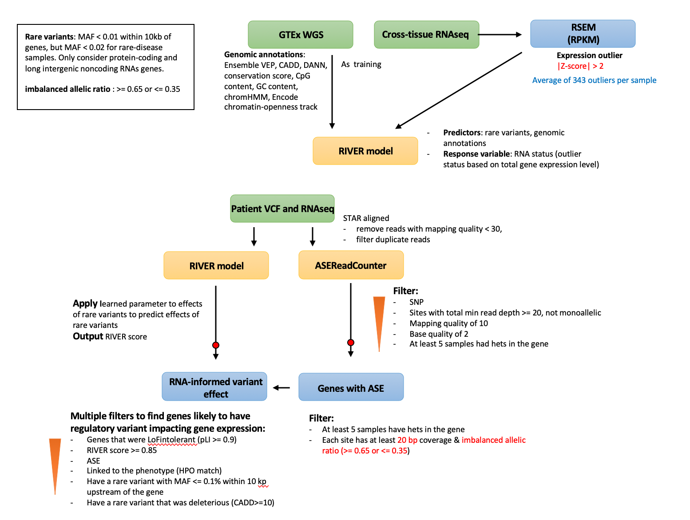

# ASE analysis pipeline comparison
##### Last updates: 07/22/2020
ASE analysis
======
**Summary**
|Paper title |author| patient cohort|control group|tool/model|results|
|--|:--:|--|--|--|--|
|Identification of rare-disease genes using blood transcriptome sequencing and large control cohorts|Fresard et al 2019 (SM))| 94 individuals with undiagnosed rare disease spanning 16 diverse disease categories|1594 unrelated controls from DGN, 49 unaffected family members from their cohort | **`RIVER`**: a hierarchical Bayesian model to infer rare variants of their regulatory effects | RNAseq yields 7.6% diagnostic rate|


#### What have been used/discussed in ASE papers:
* [Identification of rare-disease genes using blood transcriptome sequencing and large control cohorts, Fresard et al 2019](https://www.nature.com/articles/s41591-019-0457-8.pdf) generated whole-blood RNAseq (& WES/WGS) from **94 individuals with undiagnosed rare disease spanning 16 diverse disease categories**. They developed an approach **`RIVER`** to compare these patients to a large cohort of controls from Depression Genes and Network **(DGN)**, Prospective Investigation of the Vasculature in Uppsala Seniors **(PIVUS)** project, and Genotype-Tissue Expression consortium **(GTEx)**. In total, there are total **1594 unrelated controls and 49 unaffected family members** used for disease gene identification. In conclusion, (1) Using blood RNA-seq can help study rare-disease genes. Extreme gene expression and splicing events can aid in identifying candidate genes and variants. (2)`RNAseq yields 7.5% diagnostic rate in this cohort, additional 17.6% with improved candidate gene resolution`.



information:
* 350 million individuals worldwide suffer from rare disease
* current molecular diagnostic rate: 50% (mostly WES)
* RNAseq has been proven to be helpful in diagnosing when WES is uninformative
* WES did not identify the causal variant in 88.8% of patients
* 70.6% of the disease genes (for each major category) from OMIM database were found expressed in blood, and 50% of corresponding gene-splicing junctions were covered with at least 5 reads in 20% of samples
* median of 2 rare variants per gene for GTEx subjects and rare-disease subjects
```
> STAR2 2pass
> STAR2 2pass with filters
> AlleleSeq generates both a maternal and paternal genome, reads were than mapped to both genomes separately using STAR 2 pass. Reads which aligned uniquely to only one genome were kept, if reads mapped uniquely to both genomes, the higher alignment quality was used.
> STAR2 2pass with WASP filtering. 
> GSNAP with default setting and splice site annotations from hg19 refGene. (-d)
```