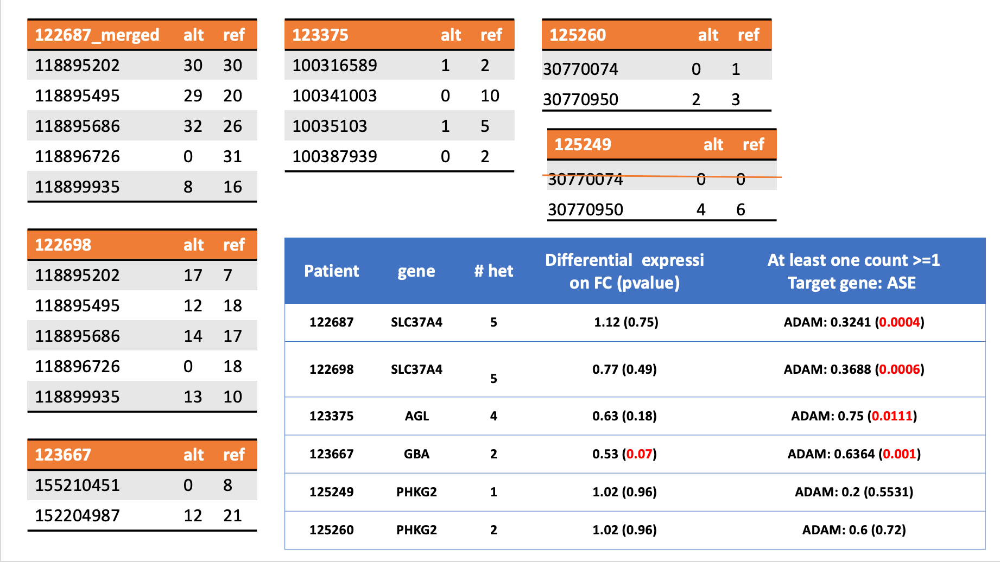
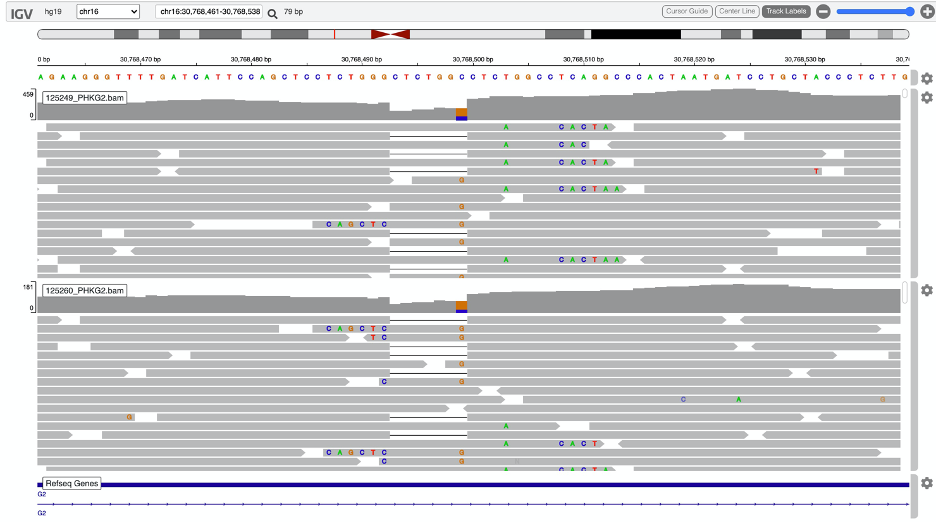
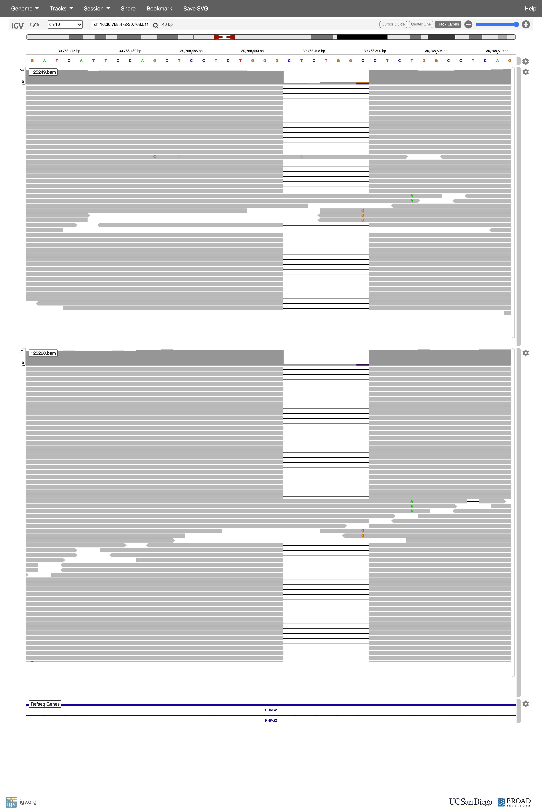
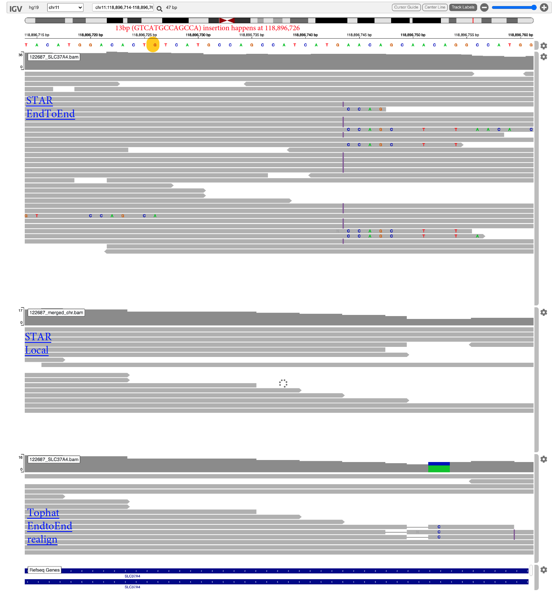

# GSD patients summary
##### Last updates: 07/15/2020
Updated ADAM results incorporating DNA VCF information in identifying hets.

**Data description:**

> **`Parsing/filtering`** threshold: total allele counts **`>=1`**

|aliqot ID| patient ID| new identifier from DNA VCF|
|--|--|--|
|122687|KG-24|390449|
|122698|CG-46|383579|
|125249|JP-06|383582|
|125260|CP-0416|383583|
|123667|NW-10|383581|
|123375|MA-1|390450|

**P.S.**

* Annotated excel sheet saved in ***GSD/GSD_allvariants_annotation.xlsx***
* mp: mpileup

* mc: manual correction

JP-06 and CP-0416 siblings with splice variant in intron
======
**Target gene - chr16: PHKG2**

@Patient: JP-06/125249

|type| source VCF|Chr| varianst pos |rs ID |gnomad AF | genotype|location|varaint type        |ALT(mp)|REF(mp)|total(mp)|AAR|
|--| --------- |-- |:------------:|:----:|:-:|:-------:|:------:|:------------------:|:----: |:----: |:------: |:------: |
|Non-coding|DNA/RNA| 16 |  ~~30768499~~ close to a deletion    | [rs77175815](http://grch37.ensembl.org/Homo_sapiens/Variation/Explore?db=core;r=16:30767999-30768999;tl=h0XsP9wDDEB4sf59-6360504;v=rs77175815;vdb=variation;vf=315567850)|G=0.00027/21 (PAGE_STUDY)|0/1   |exon    |3' UTR variant (C>G)|||||||
|Non-coding|DNA/RNA | 16 |  ~~30768503~~ close to a deletion   |[rs867637932](http://grch37.ensembl.org/Homo_sapiens/Variation/Explore?db=core;r=16:30768003-30769003;source=dbSNP;tl=hTBYYcWlacR0SAuk-6360507;v=rs867637932;vdb=variation;vf=318873162)| A=0.0962/281 (KOREAN); A=0.2407/52 (Qatari) |0/1   |exon    |3' UTR variant (substitution T>A)|||||||
|Non-coding|DNA only | 16 |  ~~30770074~~    |[rs11645367](http://grch37.ensembl.org/Homo_sapiens/Variation/Explore?db=core;r=16:30769574-30770574;tl=EuTHLgOybcYGgppD-6360513;v=rs11645367;vdb=variation;vf=312336262)|[0.06613](https://gnomad.broadinstitute.org/variant/16-30770074-C-T?dataset=gnomad_r2_1)|0/1  |   exon  |3' UTR variant (C>T)|  0|0|0||
|Non-coding|DNA/RNA | 16 |  30770950    |[rs62622830](http://grch37.ensembl.org/Homo_sapiens/Variation/Explore?db=core;r=16:30770450-30771450;tl=6RRSTBGSeJWtDc0s-6360579;v=rs62622830;vdb=variation;vf=314470340)|[0.1498](https://gnomad.broadinstitute.org/variant/16-30770950-T-C?dataset=gnomad_r2_1)|0/1   |exon    |3' UTR variant; downstream_gene_variant (missence T>C)|4|6|10|0.4|||

comments: we should not consider deletion as ASE, or variants close to deletion. SM's filter may not be applicable to our context. We have different goals. 

@Patient: 125260
|type| source VCF|Chr| varianst pos |rs ID |gnomad AF | genotype|location|varaint type        |ALT(mp)|REF(mp)|total(mp)|AAR|
|--| --------- |-- |:------------:|:----:|:-:|:-------:|:------:|:------------------:|:----: |:----: |:------: |:------: |
|Non-coding|DNA/RNA| 16 |  ~~30768499~~ close to a deletion    | [rs77175815](http://grch37.ensembl.org/Homo_sapiens/Variation/Explore?db=core;r=16:30767999-30768999;tl=h0XsP9wDDEB4sf59-6360504;v=rs77175815;vdb=variation;vf=315567850)|G=0.00027/21 (PAGE_STUDY)|0/1   |exon    |3' UTR variant (C>G)|||||||
|Non-coding|DNA/RNA | 16 |  ~~30768503~~ close to a deletion   |[rs867637932](http://grch37.ensembl.org/Homo_sapiens/Variation/Explore?db=core;r=16:30768003-30769003;source=dbSNP;tl=hTBYYcWlacR0SAuk-6360507;v=rs867637932;vdb=variation;vf=318873162)| A=0.0962/281 (KOREAN); A=0.2407/52 (Qatari) |0/1   |exon    |3' UTR variant (substitution T>A)|||||||
|Non-coding|DNA only | 16 |  30770074    |[rs11645367](http://grch37.ensembl.org/Homo_sapiens/Variation/Explore?db=core;r=16:30769574-30770574;tl=EuTHLgOybcYGgppD-6360513;v=rs11645367;vdb=variation;vf=312336262)|[0.06613](https://gnomad.broadinstitute.org/variant/16-30770074-C-T?dataset=gnomad_r2_1)|0/1  |   exon  |3' UTR variant (C>T)|1|0|1|1|||
|Non-coding|DNA/RNA | 16 |  30770950    |[rs62622830](http://grch37.ensembl.org/Homo_sapiens/Variation/Explore?db=core;r=16:30770450-30771450;tl=6RRSTBGSeJWtDc0s-6360579;v=rs62622830;vdb=variation;vf=314470340)|[0.1498](https://gnomad.broadinstitute.org/variant/16-30770950-T-C?dataset=gnomad_r2_1)|0/1   |exon    |3' UTR variant; downstream_gene_variant (missence T>C)|2|3|5|0.4|||

**chr16: 30768492 deletion (1/1); 30768499 30768503 (1/0)**

Note: those three variants are not in the coding region: 30768499, 30768503, 30770950

RNA

DNA

KG-24 and CG-46 siblings
======
**Target gene: chr11: SLC37A4**

@Patient: KG-24/122687
|type| source VCF|Chr| varianst pos |rs ID |gnomad AF | genotype|location|varaint type        |ALT(mp)|REF(mp)|total(mp)|AAR|
|--| --------- |-- |:------------:|:----:|:-:|:-------:|:------:|:------------------:|:----: |:----: |:------: |:------: |
|Non-coding|DNA/RNA| 11 | 118895202 | rs11006|G=0.186483/5847 (GnomAD)|0/1   |exon    |3' UTR variant (A>G)|30|30|60|0.5|||
|Non-coding|DNA/RNA| 11 | 118895495 | rs8301|G=0.279995/8770 (GnomAD)|0/1   |exon    |3' UTR variant (c>G)|29|20|49|0.59|||
|`coding`|DNA/RNA| 11 | 118895686 | rs8192696 |T=0.213529/53158 (GnomAD_exomes)|0/1   |exon    |synonymous_variant,coding_sequence_variant|32|26|58|0.55||||
|`coding`|DNA/RNA| 11 | 118896726 | `rs1282295559` |`NA`|0/1   |exon    |coding sequence; **`insertion 13bp`**|0|31|31|0.0|||
|`coding`|DNA/RNA| 11 | 118899935 | `rs1277675258` |C=0.000004/1 (GnomAD_exomes);C=0.000008/1 (TOPMED)|0/1   |exon    |**`pathogenic`**;missence; coding variant A>C|8|16|24|0.333|||

@Patient: CG-46/122698
|type| source VCF|Chr| varianst pos |rs ID |gnomad AF | genotype|location|varaint type        |ALT(mp)|REF(mp)|total(mp)|AAR|
|--| --------- |-- |:------------:|:----:|:-:|:-------:|:------:|:------------------:|:----: |:----: |:------: |:------: |
|Non-coding|DNA/RNA| 11 | 118895202 | rs11006|G=0.186483/5847 (GnomAD)|0/1   |exon    |3' UTR variant (A>G)|17|7|24|0.708|||
|Non-coding|DNA/RNA| 11 | 118895495 | rs8301|G=0.279995/8770 (GnomAD)|0/1   |exon    |3' UTR variant (c>G)|12|18|30|0.4|||
|`coding`|DNA/RNA| 11 | 118895686 | rs8192696 |T=0.213529/53158 (GnomAD_exomes)|0/1   |exon    |synonymous_variant,coding_sequence_variant|14|17|31|0.45|||
|`coding`|DNA| 11 | 118896726 | `rs1282295559` |`NA`|0/1   |exon    |coding sequence; **`insertion 13bp TCATGCCAGCCA`**|0|18|18|0.0|||
|`coding`|DNA/RNA| 11 | 118899935 | `rs1277675258` |C=0.000004/1 (GnomAD_exomes);C=0.000008/1 (TOPMED)|0/1   |exon    |**`pathogenic`**;missence; coding variant A>C|13|10|23|0.565|||

* insertion is not included in ASE calculation because ALT count is 0.

NW-10
======
**Target gene: chr1: GBA**

@Patient: NW-10/123667
|type| source VCF|Chr| varianst pos |rs ID |gnomad AF | genotype|location|varaint type        |ALT(mp)|REF(mp)|total(mp)|AAR|
|--| --------- |-- |:------------:|:----:|:-:|:-------:|:------:|:------------------:|:----: |:----: |:------: |:------: |
|`coding`|DNA| 1 | 155204987 | rs80356771|A=0.00003/1 (GnomAD)|0/1   |exon    |missense_variant,coding_sequence_variant G>A|12|21|33|0.364|||
|`coding`|DNA/RNA| 1 | ~~155210451~~ (actually 15210452) | rs387906315|C=0.000032/1 (GnomAD)|0/1   |exon    |`pathogenic (frameshift variant, inserG)`|0|8|8|0.0||||

MA-1
======
**Target gene: chr1: AGL**

@Patient: MA-1/123375
|type| source VCF|Chr| varianst pos |rs ID |gnomad AF | genotype|location|varaint type        |ALT(mp)|REF(mp)|total(mp)|AAR|
|--| --------- |-- |:------------:|:----:|:-:|:-------:|:------:|:------------------:|:----: |:----: |:------: |:------: |
|non-coding|DNA| 1 | 100316589 | rs2307130|G=0.416257/13043 (GnomAD)|0/1   |exon    |5_prime_UTR_variant,splice_acceptor_variant,genic_upstream_transcript_variant|1|2|3|0.333|||
|`coding`|DNA/RNA| 1 | ~~100341003~~ (OR 100341004) | .||0/1   |exon    |`pathogenic (deletion of G)` AG>A|0|10|0.00||||
|`coding`|DNA| 1 | 100358103|rs3753494|T=0.136604/4282 (GnomAD)|0/1   |exon    |missense_variant,coding_sequence_variant C>T|1|5|6|0.167|||
|non-coding|DNA| 1 | ~~100387939~~|rs3766600|C=0.36765/11492 (GnomAD)|0/1   |exon    |3_prime_UTR_variant|0|2|0.00||||

### Future
* Bill will do GSNAP for 125249, 125260, not allow mismatch, but allow mismatch in deletion. 
* look at all coding variants, VEP, AF information
* homozygous alternatives
* Bill will look at deletion with VCF shared with siblings, manually remove the deletion.