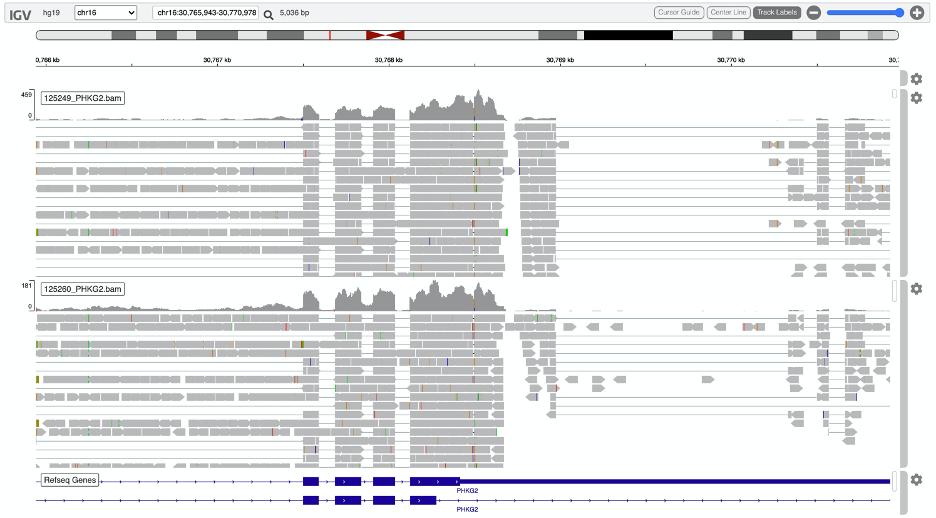

# GSD patients summary
##### Weekly updates: 06/24/2020

**P.S.**

*mc: manual correction*

Data description:

**Table: ID matching**
|aliqot ID| patient ID| identifier|
|--|--|--|
|122687|||
|122698|||
|125249|||
|125260|||
|123667|||
|123375|||

125249 and 125260 siblings
======
**Target gene: chr16: PHKG2**

Patient: 125249

| Chr| varianst pos |rs ID|phasing|location|varaint type        |ALT|REF|total|ALT (mc)|REF(mc)|total(mc)|
| -- |:------------:|:----:|:----: |:------:|:------------------:|:----: |:----: |:----: |:----: |:----: |:----: |
| 16 |  30765947    |rs1433965292 | 0/1   |intron  |intron variant (T>G) |13|2|15|13|2|15|
| 16 |  30768499    | rs77175815|0/1   |exon    |3' UTR variant (C>G)|115|60|175|115|60|175|
| 16 |  30768503    | .| 0/1   |exon    |3' UTR variant (substitution T>A)|44|294|338|44|294|338|
| 16 |  30770950    |rs62622830|0/1   |exon    |3' UTR variant (missence T>C)|4|6|10|4|6|10|
| 16 |  `30762416`    | |0/1   |intron  |`pathogenic (splice site)` ||||`23`|`24`|`47`|

Patient: 125260

| Chr| varianst pos |rs ID|phasing|location|varaint type        |ALT|REF|total|ALT (mc)|REF(mc)|total(mc)|
| -- |:------------:|:----:|:----: |:------:|:------------------:|:----: |:----: |:----: |:----: |:----: |:----: |
| 16 |  30765947    | rs1433965292|0/1   |intron  |intron variant (T>G) |8|4|12|8|4|12
| 16 |  30768499    | rs77175815|0/1   |exon    |3' UTR variant (C>G)|50|16|66|50|16|66
| 16 |  30768503    | .|0/1   |exon    |3' UTR variant (substitution T>A)|10|107|117|10|107|117
| 16 |  30770950    | rs62622830|0/1   |exon    |3' UTR variant (missence T>C)|2|3|5|2|3|5
| 16 |  `30762416`    | |0/1   |intron  |`pathogenic (splice site)` ||||`13`|`28`|`41`|

Conclusion:

Note: 

Note: those three variants are not in the coding region: 30768499, 30768503, 30770950

122687 and 122698 siblings
======
**Target gene: chr11: SLC37A4**

Patient: 122687

| Chr| varianst pos |rs ID|phasing|location|varaint type        |ALT|REF|total|ALT (mc)|REF(mc)|total(mc)|
| -- |:------------:|:----:|:----: |:------:|:------------------:|:----: |:----: |:----: |:----: |:----: |:----: |
| 11 |  30765947    |rs1433965292 | 0/1   |intron  |intron variant (T>G) |13|2|15|13|2|15|
| 11 |  30768499    | rs77175815|0/1   |exon    |3' UTR variant (C>G)|115|60|175|115|60|175|
| 11 |  30768503    | .| 0/1   |exon    |3' UTR variant (substitution T>A)|44|294|338|44|294|338|
| 11 |  30770950    |rs62622830|0/1   |exon    |3' UTR variant (missence T>C)|4|6|10|4|6|10|
| 11 |  `30762416`    | |0/1   |intron  |`pathogenic (splice site)` ||||`23`|`24`|`47`|

Patient: 122698

123667
======
**Target gene: chr1: GBA**

Patient: 123667

| Chr| varianst pos |rs ID|phasing|location|varaint type        |ALT|REF|total|ALT (mc)|REF(mc)|total(mc)|
| -- |:------------:|:----:|:----: |:------:|:------------------:|:----: |:----: |:----: |:----: |:----: |:----: |
| 1 |  155210451    |rs387906315 | 0/1   |exon  |`pathogenic (frameshift variant, inserG)` |0|8|8|`4`|`1`|`5`|

123375
======
**Target gene: chr1: AGL**

Patient: 123667

| Chr| varianst pos |rs ID|phasing|location|varaint type        |ALT|REF|total|ALT (mc)|REF(mc)|total(mc)|
| -- |:------------:|:----:|:----: |:------:|:------------------:|:----: |:----: |:----: |:----: |:----: |:----: |
| 1 |  100341003    |. | 0/1   |exon  |`pathogenic (deletion of G)` |0|10|10|`5`|`5`|`10`|

