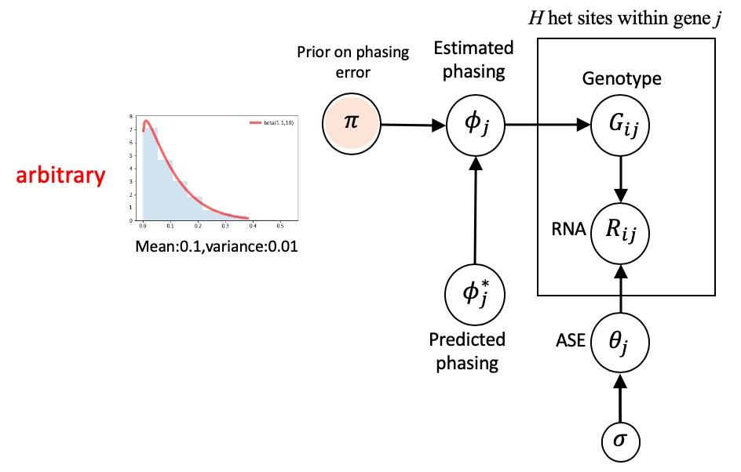
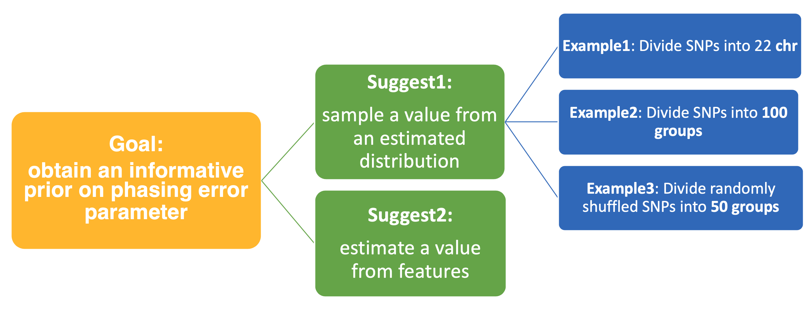
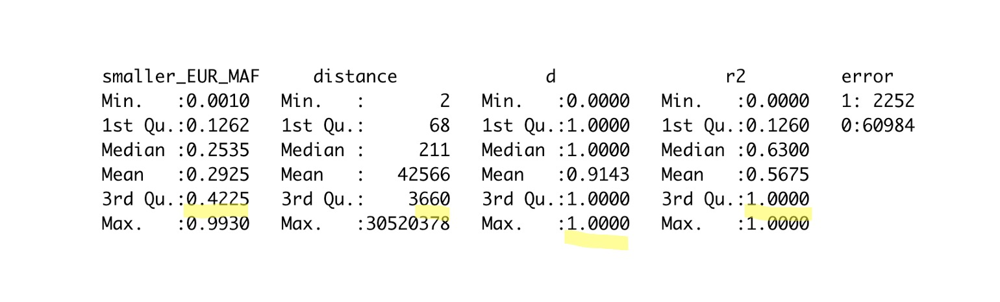
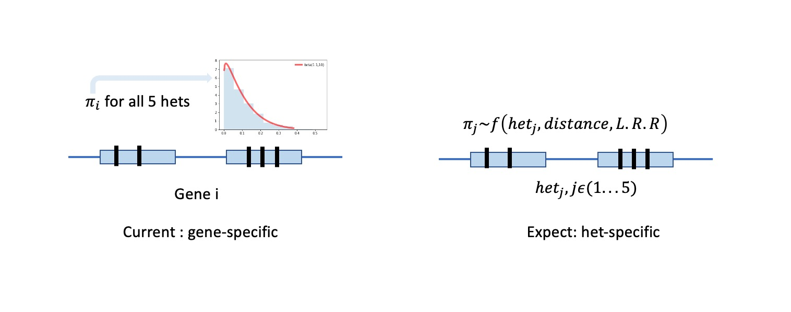
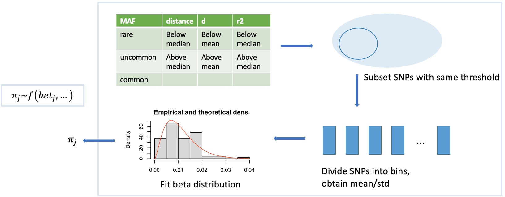
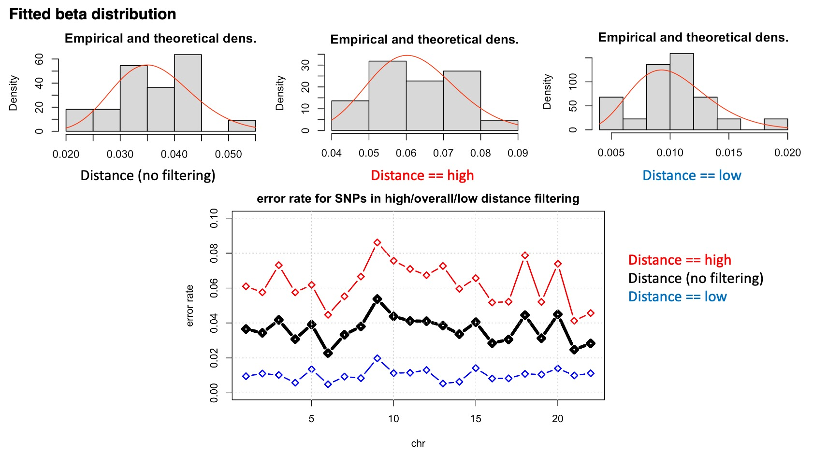
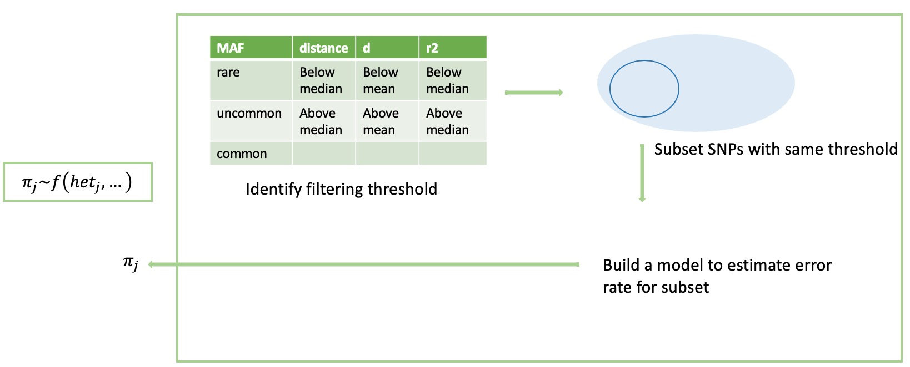
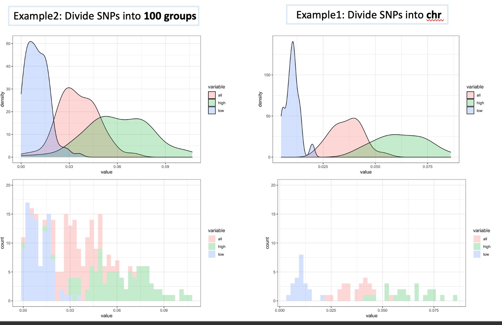
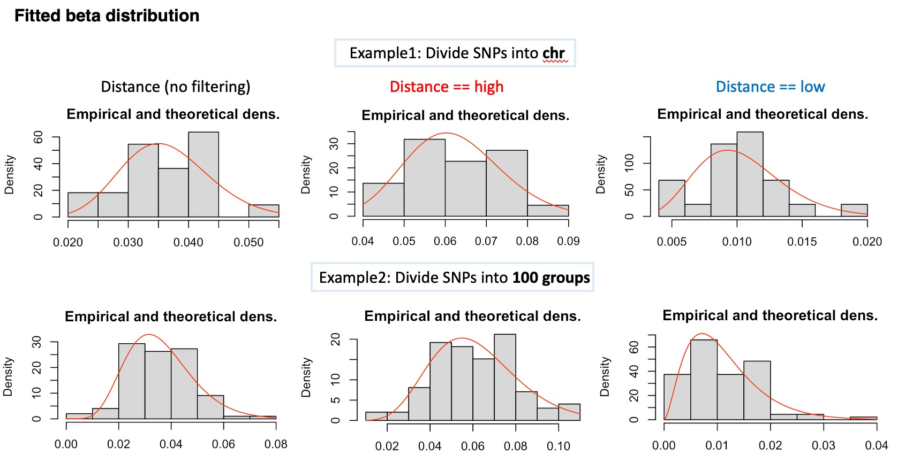

# BEASTIE prior for phasing error rate
##### Weekly updates: 06/24/2020
use the link below to obtain laTeX code
https://pandoc.org/installing.html

Goal
======
#### We want to improve prior for phasing error rate , 𝜋 , in BEASTIE model
1. version 1.0: With simple assumption of low (10%) phasing error rate for data, we use arbitray beta(1,10) distribution centers at 0.09 (highlighted in the figure above) in BEASTIE model.
2. version 2.0: Use individual data features to estimate more-informative phasing error rate for each SNP.


Background
======
#### What we learned from BEASTIE model performance already
When we assume data with 10% phasing error rate by setting 𝜋 ~ beta(1,10), we observe:
1. BEASTIE outperforms ADAM when true error rate belows 10%.
2. BEASTIE outperforms ADAM when true error rate equal/above 10% with prior distribution centers at true error rate

TO DO
======



### Step1: Setting thresholds for filtering
We want to divide interested features into bins/categories

**Table: Data statistics (example data from NA12898 phased by shapeit)**


**Table: Divide four features (for each pair of SNPs)**
| smaller MAF between 2SNPs| distance between 2SNPs| d' between 2SNPs|r2 between 2SNPs|
| -- |-- |-- |-- |
| <1% (rare)|  <211 (lower than median)    |<0.9143 (lower than mean) | <0.63 (lower than median)|
| 1%-5% (uncommon)|  >=211 (higher than median)    |>=0.9143 (higher than mean)| >=0.63 (higher than median) |
| >5% (common)| | | |


### Step2: Build a more informative prior on phasing error parameter, 𝜋


##### Current: simple assumption for low phasing error rate
```
𝑔𝑒𝑛𝑒 𝑠𝑝𝑒𝑐𝑖𝑓𝑖𝑐 𝑝𝑟𝑖𝑜𝑟: 𝜋~𝑏𝑒𝑡𝑎(1,10)
```
##### Expect: integrate information from relati                                                                                                                                                                                                                                                                                                                                                                                                                                                                                                                                                                                                       ve distance between hets/LD/L.R.R/genetics map
```
ℎ𝑒𝑡𝑠−𝑠𝑖𝑡𝑒 𝑠𝑝𝑒𝑐𝑖𝑓𝑖𝑐 𝑝𝑟𝑖𝑜𝑟: 𝜋~𝑓(𝑑𝑖𝑠𝑡𝑎𝑛𝑐𝑒,𝐿.𝑅.𝑅,etc)
```
1. sample a value from an estimated distribution. Here, we will explore examples in each feature listed in the table below, respectively
* **Example1**: Group SNPs into **`22 chr`**, obtain mean/std to fit beta distribution
* **Example2**: Group SNPs into **`100 bins`**, obtain mean/std to fit beta distribution




Example1: group by Chr
======
                                                                                                                                                                                                                                                                                                                                                                    
**1. Filtering by distance**


**2. Filtering by MAF**

**3. Filtering by d'**

**4. Filtering by r2**


Example2
======
* **Example2**: estimate a value from features



* conclusion:

Example3
======
* **Example3**: estimate a value from estimated distribution with feature binning for SNPs


**Table 3.1: example3 feature binning (for each pair of SNPs)**
| smaller MAF | relative distance | d' |r2 |
| -- |-- |-- |-- |
| <1% (rare)|  <211 (lower than median)    |<0.9143 (lower than mean) | <0.63 (lower than median)|
| 1%-5% (uncommon)|  >=211 (higher than median)    |>=0.9143 (higher than mean)| >=0.63 (higher than median) |
| >5% (common)| | | |


### Future
* check distribution for all bins, AF,D,R2

* AF separate to three bins: < 1% rare, 1-5% uncommon, >5% common

* separate SNPs into 100 bins, calculate mean (p_hat)=p and var(p_hat)=p(1-p)/N, check out relationship; read deseq2 mean/variance relationship

* check whether those BAM files remove duplicates --> subset --> visualize in IGV for deletion region; check out WGS VCF, find 7-bp deletion for 125249, 125260: /data/reddylab/GSD

* check whether those BAM files remove duplicates --> subset --> visualize in IGV for deletion region
VCF:


