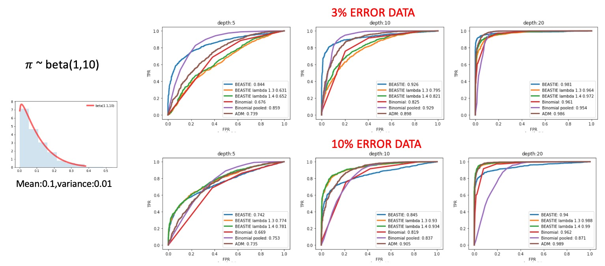
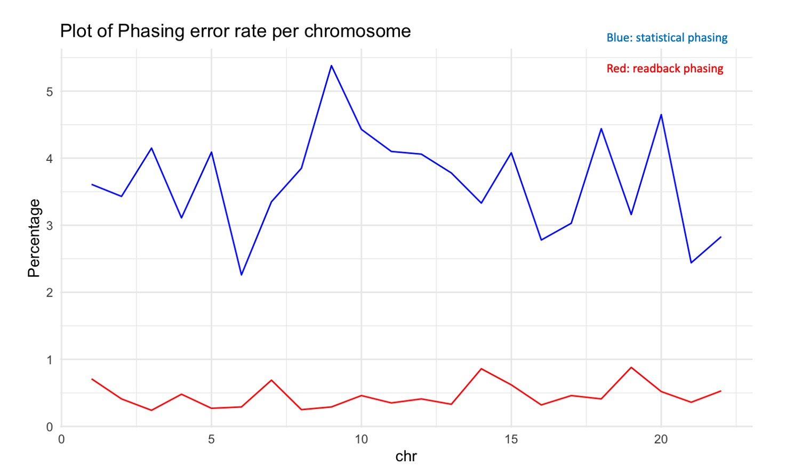

# BEASTIE prior for phasing error rate
##### Weekly updates: 06/24/2020
use the link below to obtain laTeX code
https://pandoc.org/installing.html

Goal
======
#### We want to improve prior for phasing error rate , 𝜋 , in BEASTIE model

1. version 1.0: With simple assumption of low (10%) phasing error rate for data, we use arbitray beta(1,10) distribution centers at 0.09 (highlighted in the figure above) in BEASTIE model.
2. version 2.0: Use individual data features to estimate more-informative phasing error rate for each SNP.

Background
======
#### What we learned from BEASTIE model performance already

When we assume data with 10% phasing error rate by setting 𝜋 ~ beta(1,10), we observe:
1. BEASTIE outperforms ADAM when true error rate belows 10%.
2. BEASTIE outperforms ADAM when true error rate equal/above 10% with prior distribution centers at true error rate

TO DO
======
#### Step1: Build a more informative prior on phasing error parameter, 𝜋

##### Current: simple assumption for low phasing error rate
```
𝑔𝑒𝑛𝑒 𝑠𝑝𝑒𝑐𝑖𝑓𝑖𝑐 𝑝𝑟𝑖𝑜𝑟: 𝜋~𝑏𝑒𝑡𝑎(1,10)
```
##### Expect: integrate information from relative distance between hets/LD/L.R.R/genetics map
```
ℎ𝑒𝑡𝑠−𝑠𝑖𝑡𝑒 𝑠𝑝𝑒𝑐𝑖𝑓𝑖𝑐 𝑝𝑟𝑖𝑜𝑟: 𝜋~𝑓(𝑑𝑖𝑠𝑡𝑎𝑛𝑐𝑒,𝐿.𝑅.𝑅)
```
1. sample a value from an estimated distribution


* Example1: Divide SNPs into chr, obtain mean/std


* Example2: estimate a value from features


* conclusion:


### Future
* check distribution for all bins, AF,D,R2

* AF separate to three bins: < 1% rare, 1-5% uncommon, >5% common

* separate SNPs into 100 bins, calculate mean (p_hat)=p and var(p_hat)=p(1-p)/N, check out relationship; read deseq2 mean/variance relationship

* check whether those BAM files remove duplicates --> subset --> visualize in IGV for deletion region; check out WGS VCF, find 7-bp deletion for 125249, 125260: /data/reddylab/GSD

* check whether those BAM files remove duplicates --> subset --> visualize in IGV for deletion region


