# Alignment statistics comparison
##### Weekly updates: 07/09/2020
Minimize reference bias
======
**Data description:**

HG00096 Individual RNAseq data is from 1000 Genome Project, who has caucasian ancestry. Here, we only use **bi-allelic heterozyous sites** for reference bias comparison. There are total 28,071 heterozyous sites in the VCF file, and 14,336 hets with total coverage >=1 read. 
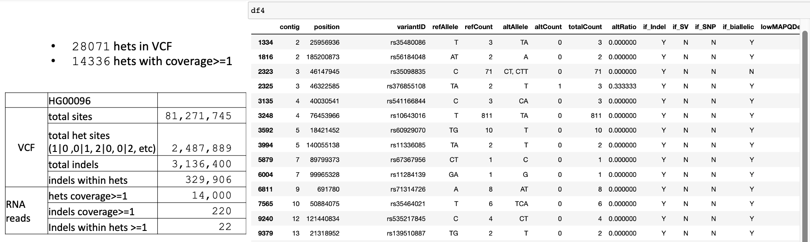

**Take home msg:**
1. availble/popular alignment tools

STAR is a popular alignment tool. STAR2 has lots of options to use, we want to choose the optimal one for ASE analysis. Thus, we will combine parameters from the options below:
* STAR 1pass
* STAR 2pass
* STAR local alignment mode
* STAR EndtoEnd alignment mode
* STAR **detection of personal variants overlapping alignment**: use `--varVCFfile` to input VCF file with personal variants. `--outSAMattribute vA vG` can output variants that overlap alignments. Specifically, `vG` can output the genomic coordinate of the variant, allowing identification of the variant. `vA` outputs which allele is detected in the read: 1 or 2 match one of the genotype alleles, 3 - no match to genotype.
* STAR **WASP filtering of allele specific alignments**:  use `--waspOutputMode` SAMtag to filter out alignment have `vW:i:2/3/4/5/6/7` tag (0.5%), only keep those alignment passed WASP filtering `vW:i:1`(1.46%) or without `vW` tag (98%). All other values means multi-mapping read, variant base in the read is N, or remapped read did not map, etc 

2. What have been used/discussed in ASE papers:
* 11111

3. mapping statistics

STAR EndtoEnd and GSNAP have more mapped reads that are properly paired (exclude S1/S2) as shown in **Figure1**.

4. efficiency

STAR EndtoEnd and GSNAP are more efficient than Tophat as shown in **Figure2**.

5. **`reference bias comparision`**

* **N_mismatch** parameter chosen for minimal reference bias as shown in **Figure 3**: Tophat2 - `5`, STAR2 - `10`, GSNAP-`10` as they set in default setting.

T1 parameter chosen: 3-10. T2 parameter chosen: 3-10. T3 parameter chosen: 3-10. S1 parameter chosen: 10. S2 parameter chosen: 10. S3 parameter chosen: 4-10. S4 parameter chosen: 4-10. S5 parameter chosen: 1-10. S6 parameter chosen: 1-10. GSNAP parameter chosen: 6,8,10.

* Use chosen **N_mismatch** parameter, we compare the alternative allele ratio (AAR) for **`bi-allelic hets`**, and we observe that T1 , T2 , T3 ,S3 ,S4 ,S6 have 0.5 median AAR, as shown in **Figure4.1**.

* Use chosen **N_mismatch** parameter, we compare the alternative allele ratio (AAR) for **`Indel hets`**, and we observe that mean AAR are `0` for all alignment tools, as shown in **Figure4.2,Figure4.3**. All of these alignemnt tools are not good choices in identifying indels.

Figures/Tables
======
**Table1: RNAseq Alignment tool mismatch parameter comparison**

**Table2: RNAseq Alignment tool with chosen parameter**
|Label |Alignment tool| Aignment mode| parameter chosen| mismatch allowed |Time cost for mapping HG00096 (min) @Figure2|
|--|:--:|--|--|--|--|
|T1_M5|Tophat2|/|/| 5| 170|
|T2_M5|Tophat2|realign|N_base penalty 1| 5| 470|
|T3_M5|Tophat2|realign|N_base penalty 0| 5| 600|
|S1_M10|STAR2 1pass|local alignment|/| 10|20|
|S2_M10|STAR2 2pass|local alignment|/| 10| 50|
|S3_M10|STAR2 1pass|EndtoEnd|/|10 | 20|
|S4_M10|STAR2 2pass|EndtoEnd|/| 10|50|
|S5_M10|STAR2 1pass|EndtoEnd|WASP| 10|20|
|S6_M10|STAR2 2pass|EndtoEnd|WASP| 10|50|
|G_M10|GSNAP|  |/| 10| 60|

**Figure1: Mapped reads stats comparison**
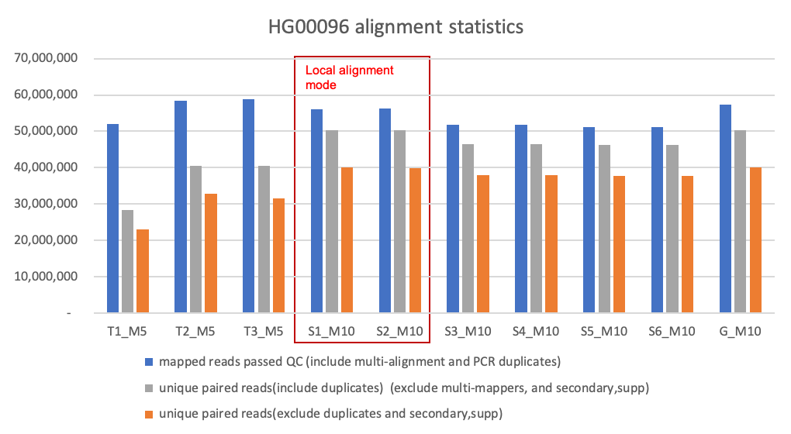

**Figure2: Alignment time comparison(min)**
")

**Figure3: N_mismatch parameter comparison**
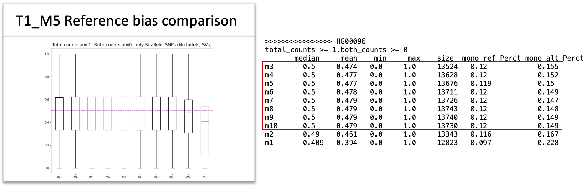

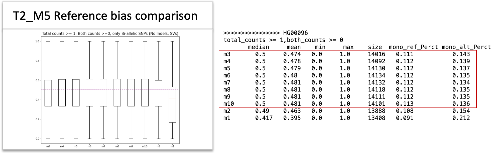

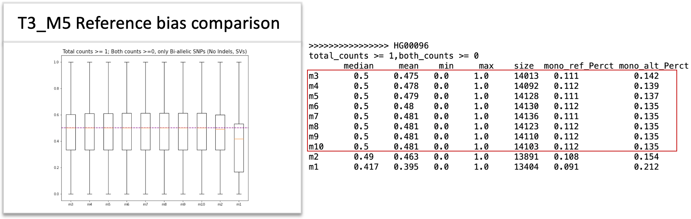

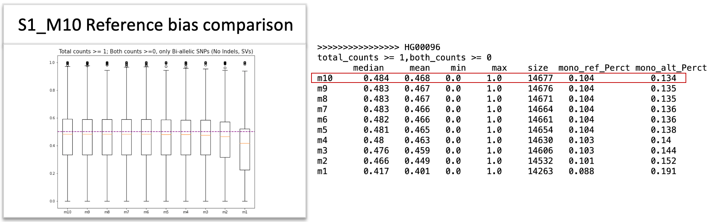

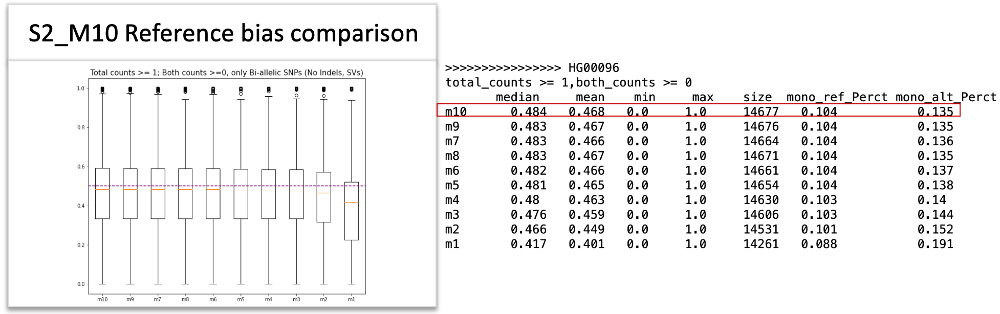

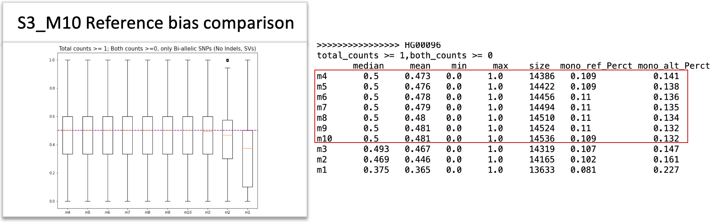

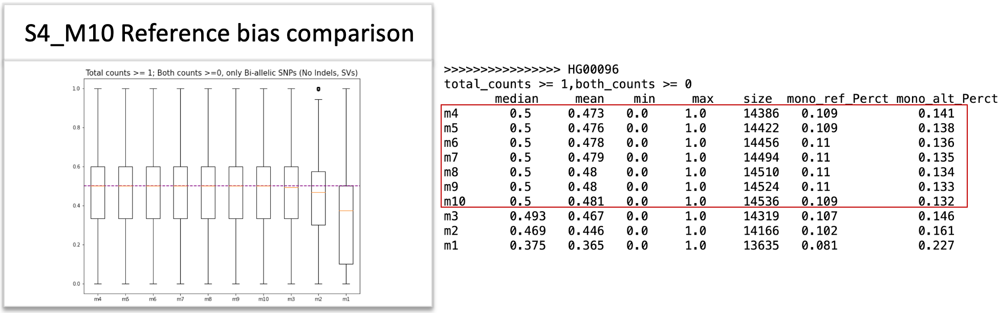

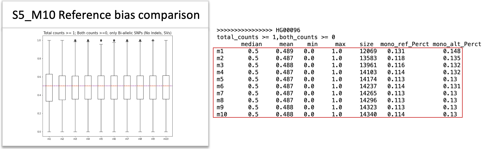

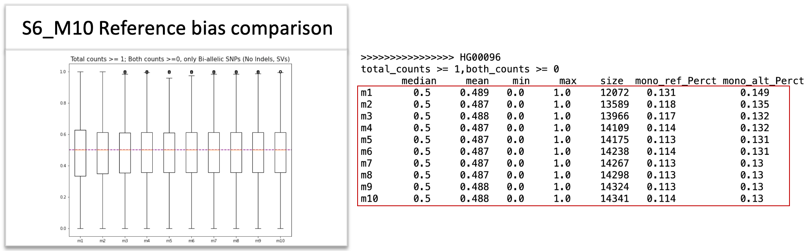

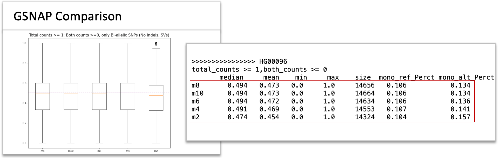

**Figure4: Reference bias comparison**
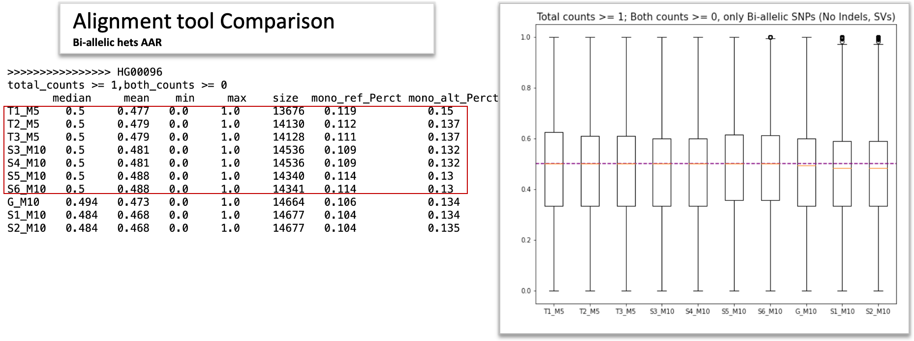

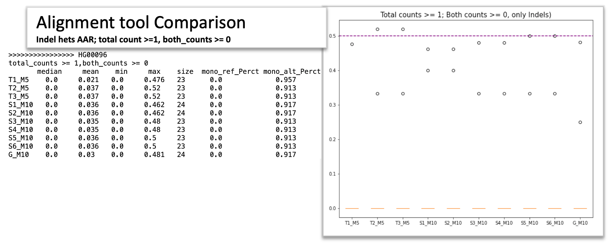

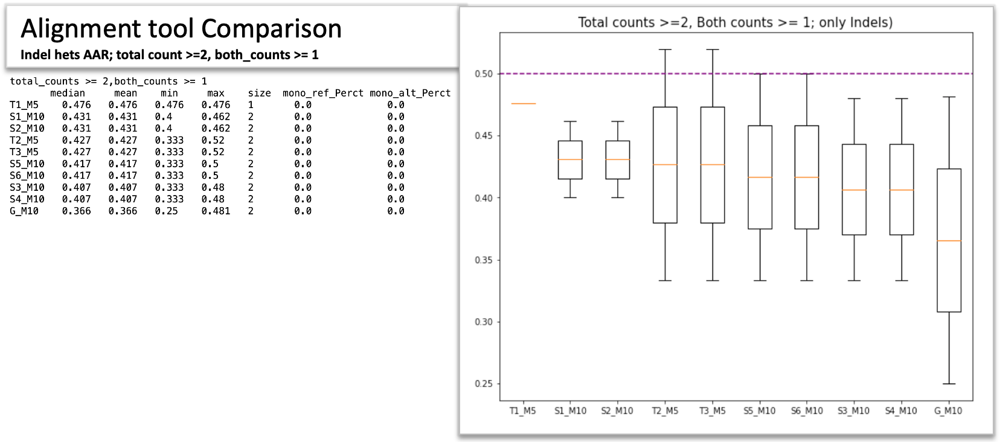
