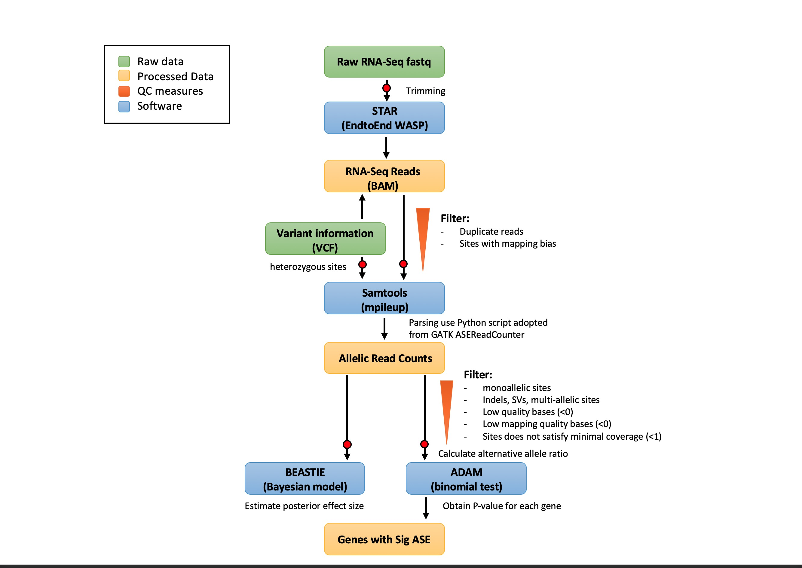
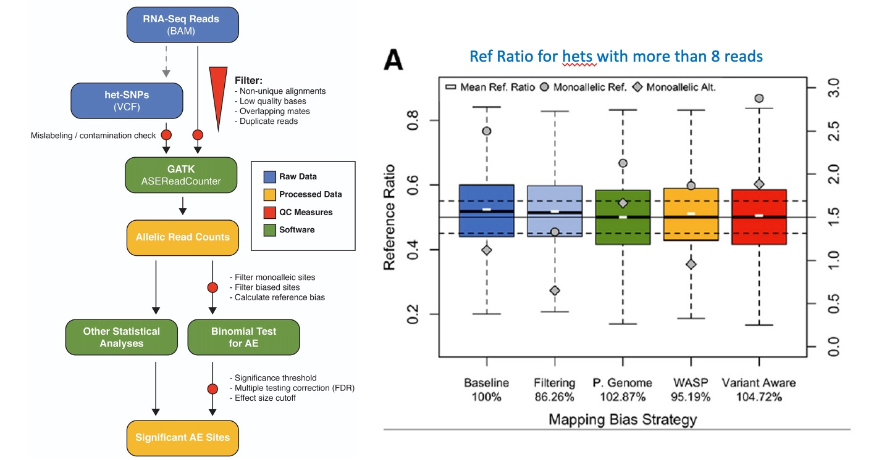
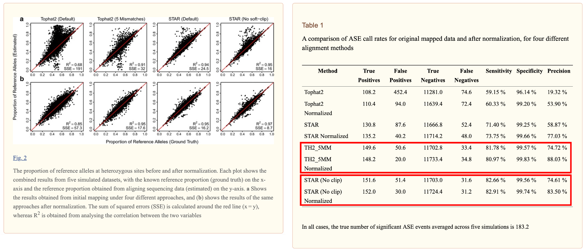
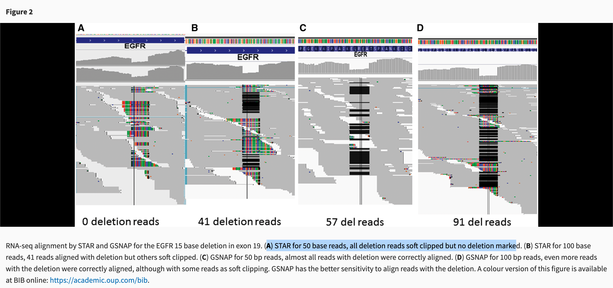

# Alignment statistics comparison
##### Weekly updates: 07/09/2020
Minimize reference bias
======
**`Take home msg`**

* **`Comparing performance (SSE, precision, TPR), time cost, and reference bias, STAR EndtoEnd (disable soft-cliping) with WASP filtering allows us to identify true ASE signal from het-SNPs with highest confidence. `**
* **Aligners with local alignment mode (allow soft-clipping) performs beter in identifing indels**.

**Summary**
|Comparisons made/question asked |paper source| tools compared| conclusion|comments|
|--|:--:|--|--|--|--|
|Identification of known 15bp deletion|Sun et al 2016|TopHat 1, 2 (with Bowtie 1, 2), Bowtie 2, HISAT, HISAT2, STAR, GSNAP, RUM and BWA|**GSNAP** > STAR > HISAT2| **`GSNAP with input of SNPs may perform the best, but it requires an input of data generated using VCF. VCF source may cause bias.`**|
|Identification of true het-SNPs|Hodgkinson et al 2016 |TopHat2 (with EndtoEnd use default 2 mismatches or 5 mismatches per read), STAR2 (with EndtoEnd and Local use default 10 mismatches per paired read)|**STAR2 EndtoEnd** and **Tophat2 EndtoEnd** have almost equal good performance in TPR and precision| **considering time efficiency, Star2 EndtoEnd is a better choice, comparing to Tophat2**|
My workflow details
======

**Data description:**

Allele-specific expression (ASE) quantifies expression variation between the 2 haplotypes of a diploid individual distinguished by hets. It can be caused by effects of genetic regulatory variants in cis, nonsense-mediated decay triggered by varaints causing a premeature stop codon, and imprinting. It quantifies expression variation between the 2 haplotypes of a diploid individual distinguished by hets.

HG00096 Individual RNAseq data and VCF file are from 1000 Genome Project, who has caucasian ancestry. We combine genome and transcriptome data to characterize cis-regulatory variation and nonsese-mediated decay via ASE analysis in order to understand genome better. Here, we only use **bi-allelic heterozyous sites** or we called it **het-SNPs** for reference bias comparison. There are total 28,071 heterozyous sites in the VCF file, and 14,336 hets with total coverage >=1 read. 


#### What have been used/discussed in ASE papers:
* [Tools and best practices for data processing in allelic expression analysis, Castel et al 2015](https://genomebiology.biomedcentral.com/articles/10.1186/s13059-015-0762-6) analyzed the properties of allelic expression read count data and technical sources of error, and provided guidelines for correcting such errors to improve the detection of relevant allelic expression. They also pointed out **AE analysis of indels is technically chanllenging because alignment error is unavoidable due to multiple mismatches**. They introduced a new tool in GATK for doing mpileup and then parsing the mpileup data, called `ASEReadCounter`, and also open-source python code in parsing mpileup data. By default, **the GATK tool count each read fragment only once** if the base calls are consistent at the site of interest, and **duplicate reads are filtered**. Other options allow filtering for coverage and for sites or reads with deletions. The figure below shows the mean reference ratio, percentage of monoallelic reference or alternative for each alignment strategy. In conslusion, they demonstrated that ***while variant aware alignment method GSNAP can find the highest number of het sites, `STAR2 with WASP filtering has minimal bias towards reference or alternative allele. STAR with Filtering simply removes monoallelic sites, did not eliminate all bias`***.

Strategies used:
```
> STAR2 2pass
> STAR2 2pass with filters
> AlleleSeq generates both a maternal and paternal genome, reads were than mapped to both genomes separately using STAR 2 pass. Reads which aligned uniquely to only one genome were kept, if reads mapped uniquely to both genomes, the higher alignment quality was used.
> STAR2 2pass with WASP filtering. 
> GSNAP with default setting and splice site annotations from hg19 refGene. (-d)
```
* [A haplotype-based normalization technique for the analysis and detection of allele specific expression, Hodgkinson et al 2016](https://www.ncbi.nlm.nih.gov/pmc/articles/PMC5020486/) proposed a new approach to **normalize RNA seuqnecing data** after mapping, by [generating an assumed high coverage null dataset](https://github.com/AJHodgkinson/ASE.) with all SNVs and indels and REF/ALT alleles are distributed at 50:50 ratio for hets, that can be used for correction of real data, in order to call ASE with high precision (true signal) in a short time-frame. After mapping the null data use the same pipeline, they used mapping bias (observed proportion of mapped alleles) observed from null data to normalize the original data.
And they characterized the levels of ASE across individuals and find a significant association between the proportion of sites undergoing ASE within the gnome ansd smoking. In consludion, they demonstrated that ***(1) STAR EndtoEnd performs the best with regards to sum of squared differences between mapped and ground truth for proportion of reference alleles at hets (SSE) and correlation of data points (R2). Followed by STAR local > Tophat2 M5 > Tophat2 M2. (2) `Star EndtoEnd and Tophat2 M5 can reach about the highest level of TPR and precision before and after applying normalization method`. (3) After testing different mismatch parameter allowed in STAR and TOPHAT, they found that when 3 or more mismatches are alllowed per read achieves a good match between the proportion of REF allele detected across all hets compared to the ground truth (R2 ~ 0.9)***

**Map RNA sequencing data with software of choice**
```
STAR	--genomeDir	STARgenome2pass	--runThreadN	threads	--alignEndsType	
EndToEnd	--readFilesIn	fastq_1.fq.gz fastq_2.fq.gz	--readFilesCommand	
zcat	--outFileNamePrefix	Outname	--outFilterMismatchNmax	10
```
```
tophat2	-o	Outname	-N	5	--read-edit-dist	5	-p	threads	
--transcriptome-index=index	bowtie2_index fastq_1.fq.gz	fastq_2.fq.gz
```
This	can	then	be	 followed	by	desired	 filtering	strategies	such	as	PCR	duplicate	removal	
and/or	 keeping	 properly	 paired	 and	 uniquely	 mapped	 reads.	 Note	 that	 in	 order	 to	
perform	 the	 next	 step,	 only	 paired	 reads	 should	 be	 kept	 (non-paired	 reads	 will	 be	
discarded	and	may	thus	bias	the	simulation).

* [TopHat2: accurate alignment of transcriptomes in the presence of insertions, deletions and gene fusions, Kim et al 2013](https://genomebiology.biomedcentral.com/articles/10.1186/gb-2013-14-4-r36) demonstraes that TopHat2 first aligns reads **end to end** with Bowtie2 before trying spliced alignments. Thus if a read is aligned end to end with, for example, one to three mismatches, then without the realignment function, TopHat2 accepts that alignment and may miss a spliced alignment with fewer mismatches. (1) `--read-realign-edit-dist 0` can be used to realign reads in the spliced alignment phase that are mapped against either transcriptome or genome. This option identifies the most spliced pair alignments and read alignments in simulated data with small indels 1-3bps (Tophat2 realignment 0 > GSNAP > STAR 1pass > Tophat2 > MapSplice). (2) Tophat use Bowtie as its core read-alignment engine, and it also has its own Indel-finding algorithm to perform gapped extension that use dynamic programming. `edit-distance = 3` allows identifying indels up to 3bps. (3) For de novo alignment, TopHat2 with realignment had the highest sensitivity, followed by MapSplice. In conclusion: ***if gene annotations are not available, TopHat2 with its realignment algorithm produce the most complete set of alignments.***
```

```
* [STAR: ultrafast universal RNA-seq aligner, Dobin et al 2013](https://www.ncbi.nlm.nih.gov/pmc/articles/PMC3530905/) provides a new ultrafast RNAseq aligner that performs sequential maximum mappable seed search followed by seed clustering and stitching. It is up to 50X faster than other aligners like TopHat. It is designed for short read sequencing reads (<= 200 bp). In default setting, the maximum number of mismatches was set at 10 per paired-end read, and the minimum/maximum intron sizes were set at 20 b/500 kb. 

**STAR 2.1.2d**
```
STAR --runThreadN <Nthreads> --genomeDir <genome_path>
--readFilesIn Read1.fastq Read2.fastq --alignIntronMin 20
--alignIntronMax 500000 -- outFilterMismatchNmax 10
```
**GSNAP 2012-07-03**
```
gsnap -B 5 -t <Nthreads> -N 1 -A sam --max-mismatches 5
--pairmax-rna 500000 -D <genome_path> -d <genome_name> Read1.fastq
Read2.fastq
```
**TopHat 2.0.0**
```
tophat --solexa1.3-quals -p $1 -r172 --min-segment-intron 20 --maxsegment-intron 500000 --min-intron-length 20 --max-intron-length
500000 <genome_name> Read1.fastq Read2.fastq
```
* [GSNAP](https://github.com/juliangehring/GMAP-GSNAP) provides a junction aware RNAseq alignment program wirks with both short and long sequence reads. They listed on website: GSNAP can detect splice junctions in individual reads.  You can detect splices using a probabilistic model using the **`--novelsplicing (or -N)`** flag. You can also detect splices from a set of splice sites (database) that you
provide, using the **`--splicesites (or -s) flag`**. You may specify both
flags, which will report splice junctions involving both known and
novel sites.


* [Indel detection from RNA-seq data: tool evaluation and strategies for accurate detection of actionable mutations, Sun et al 2016](https://academic.oup.com/bib/article/18/6/973/2562816) assess the performance from multiple aligners (***TopHat 1, 2 (with Bowtie 1, 2), Bowtie 2, HISAT, HISAT2, STAR, GSNAP, RUM and BWA***) using data with well-known **15 bp deletion** on exon where the coverage is about 100-150X in a clinical sample. (1) TopHat 1,2 did not have any reads with the deletion aligned because Bowtie2 is gapless alignment and TopHat2 uses EndtoEnd alignment mode. Thus, they concluded that **TopHat could not have good performance in aligning reads with intermediate indels**.(2) Bowtie2 with local alignment mode but not considering splicing identifies more soft-clipped reads around deletion region. no deletion marked with 50 bp reads, 8 bp deletion marked with 100 bp reads. (3) STAR did not mark any reads as deletion but soft clipped many for the 50 bp reads, but aligned a significant number of reads as deletion for the 100bp reads. (4) GSNAP aligns the highest number of deletion reads to the correct location wqith minimal soft clipping for both 50 and 100 bp reads. In summary, soft-clipped reads at the deletion edge by gapped or local alignment algorithm increase alignment sensitivity and can potentially be used for some variant calling programs to find SVs or indels thourght realignment. ***STAR, GSNAP and HISAT2 have good performance on Indel identification.***


**Tophat 2.0.12**
```
-p 4 –G -r -150 --mate-std-dev 40
```
**HISAT or HISAT2**
```
--known-splicesite-infile all default settings
```
**STAR 2.3.1z** Sequential maximum mappable seed search followed by seed clustering and stitching
```
Default settings
```
**GSNAP**
```
--use-splicing –N 1
```

My workflow details
======

my code 
```
STAR --twopassMode Basic --runThreadN 24 --genomeDir $star_ind --readFilesIn $fastqDir/*FWD_paired.fq.gz $fastqDir/*REV_paired.fq.gz  --alignEndsType EndToEnd --waspOutputMode SAMtag --varVCFfile vcf --outFilterMismatchNmax 10 --outSAMtype BAM SortedByCoordinate --outReadsUnmapped Fastx --outSAMattributes NH HI NM MD AS nM jM jI XS vA vG vW --readFilesCommand "gunzip -c" --outFileNamePrefix $OutPATH
```
SJ.out.tab contains high confidence collapsed splice junctions in tab-delimited format. Note that
STAR defines the junction start/end as intronic bases, while many other software define them as
exonic bases.The filtering for this output file is controlled by the --outSJfilter* parameters
```
tophat -o $OutPATH --read-mismatches 5 --b2-np 0 --read-gap-length 10 --read-edit-dist 10 --mate-inner-dist 60 --mate-std-dev 60 --read-realign-edit-dist 0 -p 4 -G $InDir/coding-and-noncoding.gff $ref_ind FWD_paired.fq.gz  REV_paired.fq.gz
```
```
gmap-2019-03-15/bin/gsnap --gunzip -D gmap-2019-03-15/share -d hg19 R1.fastq.gz R2.fastq.gz -B 5 -t 20 -N 1 -A sam --max-mismatches 5 -A sam -o GsnapOutput.sam

```
1. availble/popular alignment tools

TOPHAT is a popular spliced aligner for RNA-seq experiements. TopHat2 allows for variable-length indels with respect to the reference genome. In addition to de novo spliced alignment, TopHat2 can align reads across fusion breaks. 
* default setting: allows for a max of 2 mismatches per read

STAR is a popular alignment tool. STAR2 has lots of options to use, we want to choose the optimal one for ASE analysis. Thus, we will combine parameters from the options below:
* default setting: allows for a max of 10 mismatches per read pair
* STAR 1pass
* STAR 2pass : splice junctions are detected during a first pass mapping, and these are used to inform a second round of mapping.
* STAR local alignment mode
* STAR EndtoEnd alignment mode : semi-global alignment
* STAR **detection of personal variants overlapping alignment**: use `--varVCFfile` to input VCF file with personal variants. `--outSAMattribute vA vG` can output variants that overlap alignments. Specifically, `vG` can output the genomic coordinate of the variant, allowing identification of the variant. `vA` outputs which allele is detected in the read: 1 or 2 match one of the genotype alleles, 3 - no match to genotype.
* STAR **WASP filtering of allele specific alignments**:  use `--waspOutputMode` SAMtag to filter out alignment have `vW:i:2/3/4/5/6/7` tag (0.5%), only keep those alignment passed WASP filtering `vW:i:1`(1.46%) or without `vW` tag (98%). All other values means multi-mapping read, variant base in the read is N, or remapped read did not map, etc 

2. mapping statistics

STAR EndtoEnd and GSNAP have more mapped reads that are properly paired (exclude S1/S2) as shown in **Figure1**.

3. efficiency

**STAR EndtoEnd and GSNAP are more efficient than Tophat** as shown in Figure2.

4. **`reference bias comparision`**

* **N_mismatch** parameter chosen for minimal reference bias as shown in **Figure 3**: Tophat2 - `5`, STAR2 - `10`, GSNAP-`10` as they set in default setting.

T1 parameter chosen: 3-10. T2 parameter chosen: 3-10. T3 parameter chosen: 3-10. S1 parameter chosen: 10. S2 parameter chosen: 10. S3 parameter chosen: 4-10. S4 parameter chosen: 4-10. S5 parameter chosen: 1-10. S6 parameter chosen: 1-10. GSNAP parameter chosen: 6,8,10.

* Use chosen **N_mismatch** parameter, we compare the alternative allele ratio (AAR) for **`bi-allelic hets`**, and we observe that T1 , T2 , T3 ,S3 ,S4 ,S6 have 0.5 median AAR, as shown in **Figure4.1**.

* Use chosen **N_mismatch** parameter, we compare the alternative allele ratio (AAR) for **`Indel hets`**, and we observe that mean AAR are `0` for all alignment tools, as shown in **Figure4.2,Figure4.3**. All of these alignemnt tools are not good choices in identifying indels.

**Parsing details:**
1. mpileup code

**Quality control for technical error as mentioned in (Castel et al 2015)**
* Coverage filter: **`Our filtering >=1 total count`**;**ASEReadCounter** use het-SNP>=8 for both allele; **(Hodgkinson et al 2016)** use het-SNP >= 12 total count
* low-quality : remove reads with a potentially erroneous base over the hets based on low base quality (**`Our Parsing`**,**ASEReadCounter**)
* duplicated reads : PCR duplicats with same start/end pos. (**`PICARD`**, **ASEReadCounter**)
* double-counted RNA-seq reads : each fragment, representing one molecule, is counted only once per het-SNP. (**ASEReadCounter**)**(Hodgkinson et al 2016)**
* genotyping error : **`BEASTIE`** use estimated distribution of true phasing error rate from population, **ASEReadCounter** use a genotype error filter of average amount of squencing noise per sample and then use binomial test to estiamte if the counts of REF/ALT alleles are sig higher than the noise. If not, then the site is marked with error as false het site.
*  mappabiliity filter/allelic mapping bias (**`STAR2 WASP filtering`**, **ASEReadCounter** removes reads with mappability score <1, and with mapping bias in simulation --> AAR will be < 0.5, use this as null in binomial test)
* ~~technical covariates due to sample preparation and sequencing~~
* ~~variation in total read depth~~


**statistical test for AE**
| AE statistical test | strategy |
|:--:|:--:|
|binomial test to determine whether the ratio of the 2 alleles is significantly different from 0.5| |
|statistical model with beta-binomial model to infer the level of overdispersion from putative technical effects| |
|```AE = abs((ALT-REF)/total count)``` for each het, AE p-value of a gene obtained as the percentile of the `mean AE` in 10000 estimated value from binomial distribution(`mean total count`,0.5) -> gene with significant allelic imbalance| **ADAM**|
|`AE = abs(0.5 - reference allele ratio)` for each site, and then calculate `median AE` for each egene (gene with eQTL), binomial test with `FDR<=5%` cutoff -> gene with significant allelic imbalance| **ASEReadCounter**|
|site with ASE if binomial test with P < 0.005 | **Hodgkinson et al 2016**|
Figures/Tables
======
**Table1: RNAseq Alignment tool mismatch parameter comparison**

**Table2: RNAseq Alignment tool with chosen parameter**
|Label |Alignment tool| Aignment mode| parameter chosen| mismatch allowed |Time cost for mapping HG00096 (min) @Figure2|
|--|:--:|--|--|--|--|
|T1_M5|Tophat2|default EndtoEnd|/| 5 per read| 170|
|T2_M5|Tophat2|default EndtoEnd realign|N_base penalty 1| 5 per read| 470|
|T3_M5|Tophat2|default EndtoEnd realign|N_base penalty 0| 5 per read| 600|
|S1_M10|STAR2 1pass|default local alignment (soft-clip)|| 10 per read pair|20|
|S2_M10|STAR2 2pass|default local alignment (soft-clip)|/| 10 per read pair| 50|
|S3_M10|STAR2 1pass|EndtoEnd (no soft-clip)|/|10 per read pair | 20|
|S4_M10|STAR2 2pass|EndtoEnd  (no soft-clip)|/| 10 per read pair|50|
|S5_M10|STAR2 1pass|EndtoEnd (no soft-clip)|WASP | 10 per read pair|20|
|S6_M10|STAR2 2pass|EndtoEnd (no soft-clip)|WASP| 10 per read pair|50|
|G_M10|GSNAP|  |/| 10 per read pair| 60|

**Figure1: Mapped reads stats comparison**


**Figure2: Alignment time comparison(min)**
")

**Figure3: N_mismatch parameter comparison**


**Figure4: Reference bias comparison**


