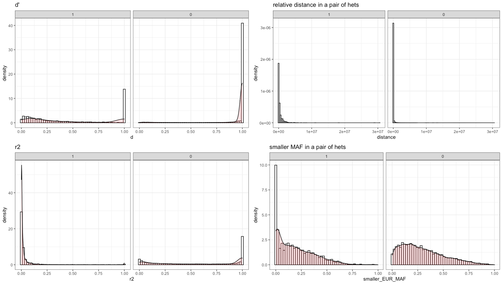
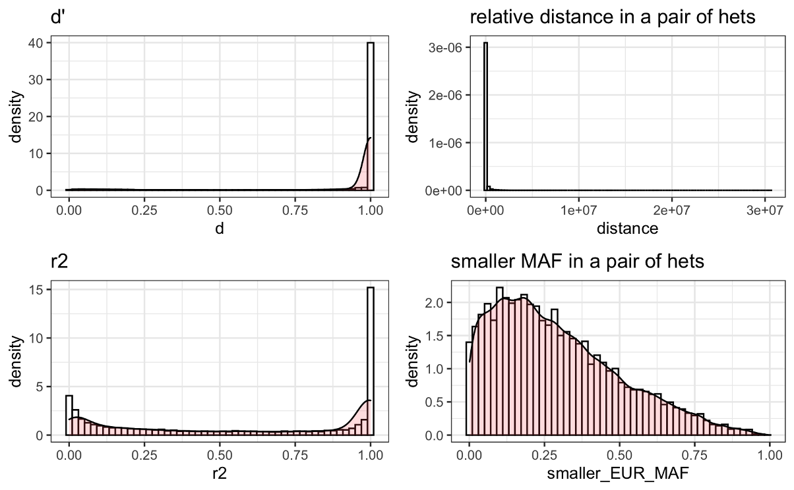
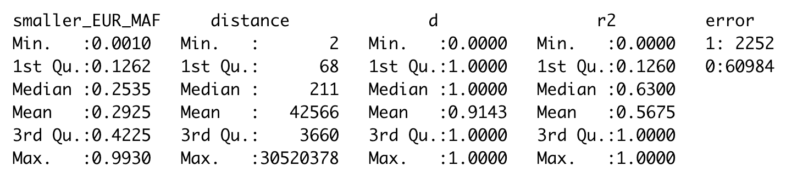
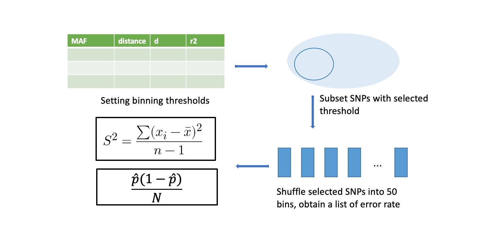
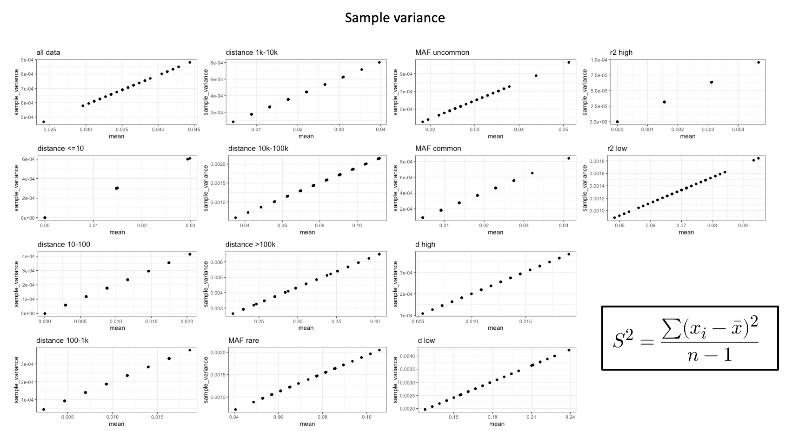
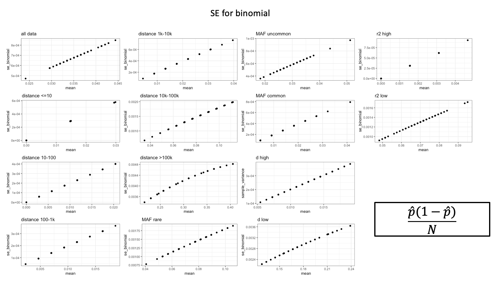
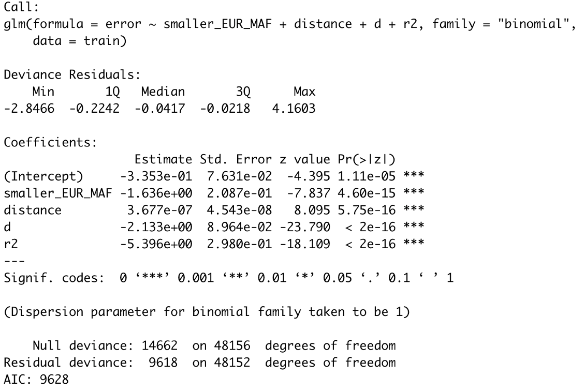

# Logistic regression model II
##### Last updates: 07/15/2020

Summary
======

Finalize the model
======
## Step1: Explore the feastures that have predictive power on phasing error

##### four features distribution by class

##### four features distribution

##### dicatomize features

## Step2: Check mean-variance relationship & mean-square-error relationship
binned data: data was binned by certain characteristics and then splitted randomly into 50 subgroups

\overline{R}

**sample_varaince**

**standard error for binomial**

## Step3: Check sample variance and standard error for binomial on mean phasing error rate for binned data

## Step3: logistic regression
**1. Intercept model**

**2. full model**
##### logistic regression model shows that all four features (IVs) have significant affect on error (DV)

**3. overfitted model (with all intxn terms)**
