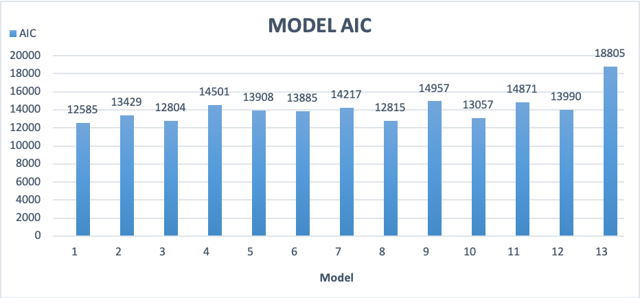
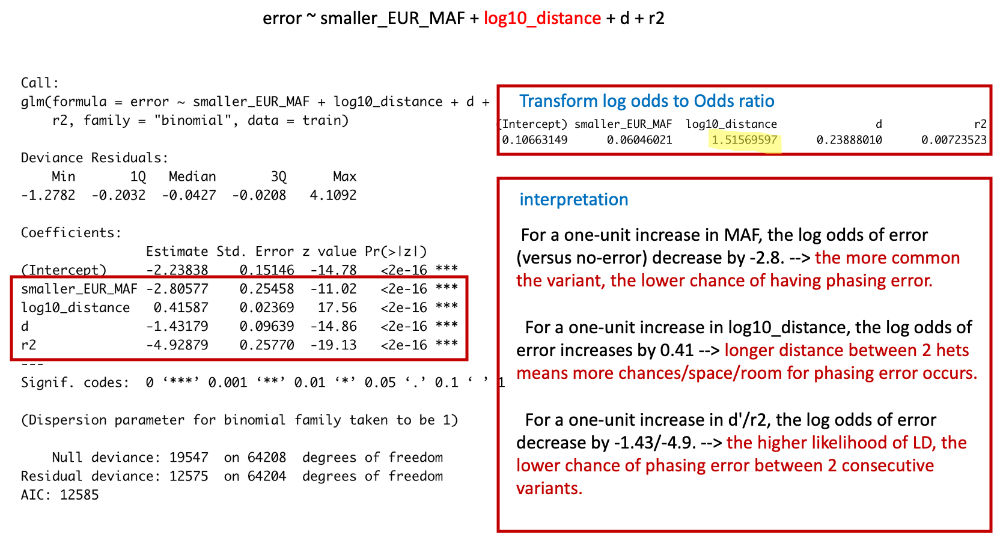
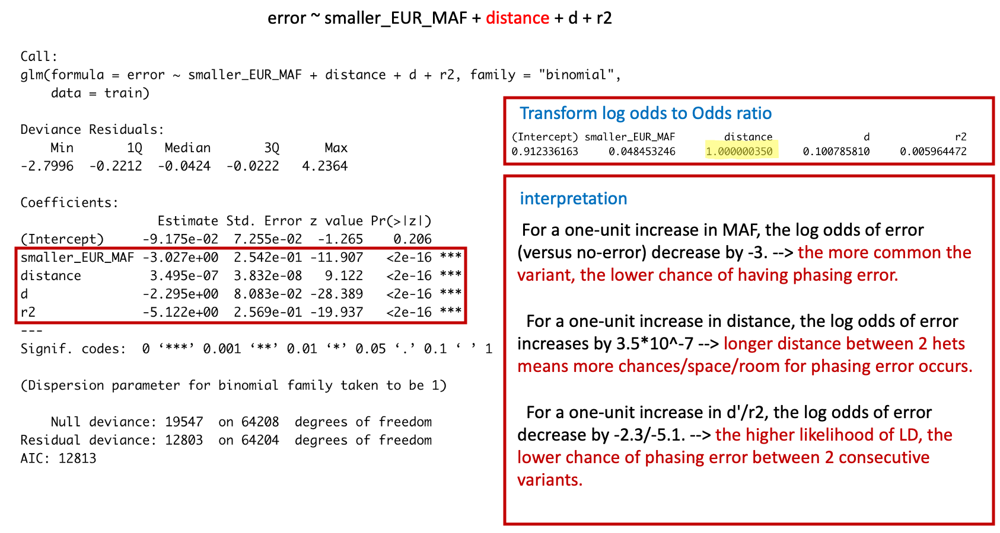

# Logistic regression model I
##### Last updates: 07/15/2020
Decide what to be included in the model

Finalize the model
======

**`Take home msg`**
* we choose **log10_distance** over **distance** because model with log10_distance has higher odds ratio. (Figure2)
```
Model                                  estimate     odds ratio         AIC
Error ~ log10_distance                 1.10643     3.0235304727       14957
Error ~ distance                       1.746e-06   1.00000175         18153
```
* we choose **d'** over **r2** because **model2** has higher AIC  compared to **model3** (Figure1)


**Table1: model AIC**
|Model| details| AIC|
|--|--|--|
|1|MAF + log10(distance) + d' + r2|12585|
|2|MAF + log10(distance) + d'     |13429|
|3|MAF + log10(distance) + r2     |12804|
|4|MAF + log10(distance)          |14501|
|5|MAF + d'                       |13908|
|6|MAF + r2                       |13885|
|7|log10(distance) + d'           |14217|
|8|log10(distance) + r2           |12815|
|9|log10(distance)                |14957|
|10|d' + r2                       |13057|
|11|d'                            |14871|
|12|r2                            |13990|
|13|MAF                           |18805|

**Figure1: model AIC**




**Figure2: distance and log distance**



