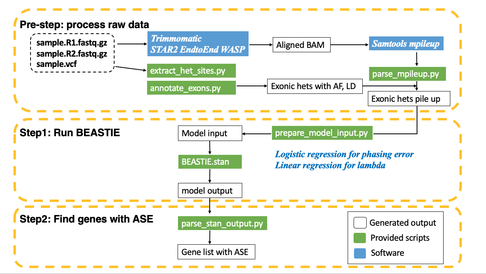

# BEASTIE: A bioinformatics method for estimation of gene level ASE
BEASTIE (Bayesian Estimation of Allele Specific Transcription Integrating across Exons) is a software suite for identifying allele-specific-expression (ASE) from regulatory variants from RNA-seq and WGS data.
BEASTIE uses a Bayesian hierarchical model to integrate prior information with read count data and genetic data. Using MCMC (Markov Chain Monte Carlo), BEASTIE efficiently performs posterior inference to estimate effect sizes of ASE. <br>
BEASTIE has been found to be substantially more accurate than other tests based on the binomial distribution.

BEASTIE is free for academic and non-profit use.

## Installation
### Prerequisites
The following are required to install and run BEASTIE directly on your system:
* BEASTIE has been tested on **Linux**. It may or may not work on other UNIX systems.
* [CmdStan](https://mc-stan.org/users/interfaces/cmdstan) must be installed.  This is the command-line interface to the STAN statistical programming language.
* [Python](https://www.python.org/downloads/release/python-360/) version 3.6 or higher is required.
* [htslib](https://www.htslib.org/)
* [bedtools2.25]
* [picard](https://broadinstitute.github.io/picard/) - put location of .jar file in parameters.cfg
* [samtools1.9](https://github.com/samtools/samtools)
* [STAR2.7](https://github.com/alexdobin/STAR)
* [Trimmomatic](https://github.com/usadellab/Trimmomatic) - put location of .jar file in parameters.cfg
* [vcftools](https://vcftools.github.io/)

### Installing and Compiling BEASTIE source code
First download BEASTIE, copy its files into your working directory.
```python
s = "example code"
```
Then, install [CmdStan](https://mc-stan.org/users/interfaces/cmdstan), and set the environment variable $STAN to the directory where CmdStan has been installed. 
```python
s = "example code"
```

## Workflow
### Summary of steps
Multiple steps are needed to identify gene level ASE. Broadly, these steps are:

* Step1: Gene-level pileup read counts generation. Using STAR 2Pass EndtoEnd alignment mode with WASP filtering for RNAseq fastq data alignment, and extract heterozygous sites from VCF files for samtools mpile up. 
* Step2: BEASTIE model input data preparation. Parsing pileup read counts by using the faster adopted python script from [ASEreadCounter](https://github.com/gimelbrantlab/ASEReadCounter_star). 
* Step3: Identification of genes with ASE by running BEASTIE.


### Summary of workflow

Functionally, these above steps are accomplished by individual bash/Python3 scripts, alongside the prior listed dependencies. This workflow is summarized in the below figure:


 
This workflow is summarized step-by-step below. 
  
0. input files
----------------------------------------
The following input files will be referenced in the below workflow steps:
* sample.R1.fastq.gz/sample.R2.fastq.gz: paired-end RNAseq fastq files for sample of interest. We recommend using splice-aware aligner STAR: : https://github.com/alexdobin/STAR. If you have already aligned BAM files, you can directly use that as input.
* sample.vcf: VCF file from whole genome sequencing containing information for variants.
* reference.fa ($ref): reference genome fasta file, preferably the same file used to generate genme index for STAR.


1. process raw data (optional if you use your aligned BAM)
----------------------------------------
This step trim RNAseq fastq reads with Trimmomatic, and align reads with STAR 
make sure VCF file has 'chr' in the chromosome column.
```
java -jar $trimmomatic_path/trimmomatic-0.33.jar PE -threads 16 -phred33 $fastq_R1 $fastq_R2 $trimmed_fastq/${sample}_FWD_paired.fq.gz $trimmed_fastq/${sample}_FWD_unpaired.fq.gz $trimmed_fastq/${sample}_REV_paired.fq.gz $trimmed_fastq/${sample}_REV_unpaired.fq.gz ILLUMINACLIP:$trimmomatic_reference/trimmomatic_MHPS.fa:2:30:10:8:TRUE LEADING:30 TRAILING:30 SLIDINGWINDOW:4:15 MINLEN:36
```

```
STAR --twopassMode Basic --runThreadN 24 --genomeDir $star_ind \
    --readFilesIn $fastqDir/${sample}_FWD_paired.fq.gz $fastqDir/${sample}_REV_paired.fq.gz \
    --alignEndsType EndToEnd \
    --waspOutputMode SAMtag \
    --varVCFfile $VCF \
    --outFilterMismatchNmax 10 \
    --outSAMtype BAM SortedByCoordinate \
    --outReadsUnmapped Fastx \
    --outSAMattributes NH HI NM MD AS nM jM jI XS vA vG vW \
    --readFilesCommand "gunzip -c" \
    --outFileNamePrefix $prefix
```

```
samtools mpileup -d 0 -B -s -f $ref -l $het_sites_for_mpileup $Star_aligned_sortedByCoord_picard_markdup_filter.bam > result.pileup
```

2. parse_mpileup.py
----------------------------------------
3. prepare_model_input.py
----------------------------------------
Before the BEASTIE model can be run, you must create a file containing the read counts for each allele of a gene.  The format of this required file is described below.
```
gene_ID | ALT1 | REF1 | ALT2 | REF2 | pred_prob
```

4. stan_wrapper.py
----------------------------------------
The model (BEASTIE.stan) must be run in the $STAN directory.  The following command will run the model on a set of variants:
```
python stan_wrapper.py $model_input $sigma $BEASTIE $in_path $sample
```
The parameters are:
* $model_input: prepared model input file
* $BEASTIE: $STAN/BEASTIE
* $sigma: 0.5
* $in_path: path for prepared model input file
* $sample: sample name


5. parse_stan_output.py
----------------------------------------
TBD

