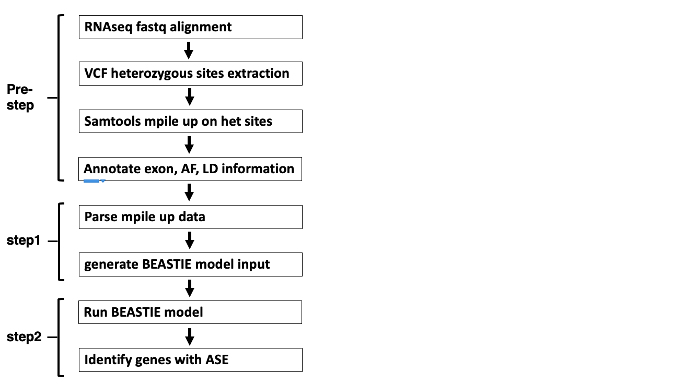

# BEASTIE: A bioinformatics method for gene level ASE estimation
BEASTIE (Bayesian Estimation of Allele Specific Transcription Integrating across Exons) is a software suite for identifying allele-specific-expression (ASE) from regulatory variants from RNA-seq and WGS data.
BEASTIE uses a Bayesian hierarchical model to integrate prior information with read count data and genetic data. Using MCMC (Markov Chain Monte Carlo), BEASTIE efficiently performs posterior inference to estimate effect sizes of ASE. <br>

The BEASTIE workflow is currently set up for gene-level ASE estimation. This method has been tested in Europeran individual NA12878, and African individual NA19247 from 1000 Genome Project. 

BEASTIE has been found to be substantially more accurate than other tests based on the binomial distribution.

BEASTIE is free for academic and non-profit use.

## Installation
### Prerequisites
The following are required to install and run BEASTIE directly on your system:
* BEASTIE has been tested on **Linux**. It may or may not work on other UNIX systems.
* [CmdStan](https://mc-stan.org/users/interfaces/cmdstan) must be installed.  This is the command-line interface to the STAN statistical programming language.
* [Python](https://www.python.org/downloads/release/python-360/) version 3.6 or higher is required.
* [htslib](https://www.htslib.org/)
* [bedtools2.25](https://bedtools.readthedocs.io/en/latest/content/installation.html)
* [picard](https://broadinstitute.github.io/picard/) - set location as $picard_path
* [samtools1.9](https://github.com/samtools/samtools)
* [STAR2.7](https://github.com/alexdobin/STAR)
* [Trimmomatic](https://github.com/usadellab/Trimmomatic) - set location as $trimmomatic_path
* [vcftools0.1.15](https://vcftools.github.io/)

### Installation steps

Using a Python 3.8 VirtualEnv:
```python
s = "example code"
```
Using Singularity with Docker Image:
```
```
Customized installation

Installing and Compiling BEASTIE source code
First download BEASTIE, copy its files into your working directory.
Then, install [CmdStan](https://mc-stan.org/users/interfaces/cmdstan), and set the environment variable $STAN to the directory where CmdStan has been installed. 
```bash
cd $STAN
mkdir BEASTIE #download BEASTIE.stan in this directory
make $STAN/BEASTIE/BEASTIE
```

## Workflow
### Summary of steps
Multiple steps are needed to identify gene level ASE. Broadly, these steps are:

* Pre-step: Gene-level pileup read counts generation. We recommend using STAR 2Pass EndtoEnd alignment mode with WASP filtering for RNAseq fastq data alignment, and extract heterozygous sites from VCF files for samtools mpile up. Extract allele frequency information for each heterozygous variant, and obtain linkage equlibirum information for each pair of consecutive heterozygous variants. 
* Step1: BEASTIE model input data preparation. Parsing pileup read counts by our faster version python script originally adopting from [ASEreadCounter](https://github.com/gimelbrantlab/ASEReadCounter_star). 
* Step2: Identification of genes with ASE. Parsing BEASTIE model output with customized significance cutoff.



### Summary of workflow

Functionally, these above steps are accomplished by individual Python3 scripts, alongside the prior listed dependencies. This workflow is summarized in the below figure:


 
This workflow is summarized step-by-step below. 
  
----------------------------------------
0. input files (required)

The following input files will be referenced in the below workflow steps:
* sample.R1.fastq.gz ($fastq_R1)/sample.R2.fastq.gz ($fastq_R2): paired-end RNAseq fastq files for sample of interest. 
* sample.vcf ($vcf): VCF file from whole genome sequencing containing information for variants.
* reference.fa ($ref): reference genome fasta file, preferably the same file used to generate genme index for STAR.

----------------------------------------
1. process raw data (optional pre-step with provided commands)
(a) This step processes trim raw RNAseq fastq reads
```
java -jar $trimmomatic_path/trimmomatic-0.33.jar PE -threads 16 -phred33 $fastq_R1 $fastq_R2 \
   $trimmed_fastq/${sample}_FWD_paired.fq.gz $trimmed_fastq/${sample}_FWD_unpaired.fq.gz \
   $trimmed_fastq/${sample}_REV_paired.fq.gz $trimmed_fastq/${sample}_REV_unpaired.fq.gz \
   ILLUMINACLIP:$trimmomatic_reference/trimmomatic_MHPS.fa:2:30:10:8:TRUE LEADING:30 TRAILING:30 SLIDINGWINDOW:4:15 MINLEN:36
```
The parameters are:
* $trimmed_fastq: saving trimmed fastq output path
* $sample: sample name or prefix for output
----------------------------------------

(b) This step align reads with STAR<br>
We have done extensive comparison on RNAseq alignes reference allele mapping bias, and found that the best one with high efficiency and minimal bias is splice-aware aligner STAR with 2pass EndtoEnd alignment mode and WASP filtering : https://github.com/alexdobin/STAR. If you prefer to use aligned BAM files, you can directly use that as input. 
```
STAR --twopassMode Basic --runThreadN 24 --genomeDir $star_ind \
    --readFilesIn $fastqDir/${sample}_FWD_paired.fq.gz $fastqDir/${sample}_REV_paired.fq.gz \
    --alignEndsType EndToEnd \
    --waspOutputMode SAMtag \
    --varVCFfile $VCF \
    --outFilterMismatchNmax 10 \
    --outSAMtype BAM SortedByCoordinate \
    --outReadsUnmapped Fastx \
    --outSAMattributes NH HI NM MD AS nM jM jI XS vA vG vW \
    --readFilesCommand "gunzip -c" \
    --outFileNamePrefix $output_prefix
    
java -jar $picardDir/picard.jar MarkDuplicates \
   I=$output_prefix/Aligned.sortedByCoord.out.bam \
   O=$output_prefix/Aligned.sortedByCoord.out.picard_markdup.bam
```
The parameters are:
* $fastqDir: input path for trimmed fastq
* $star_ind: index for STAR aligner
* $VCF: VCF file for sample. VCF file has 'chr' in the chromosome column.
* $sample: sample name or prefix for output
* $output_prefix: output path with output prefix for aligned BAM

----------------------------------------
(c) This step pile up reads for each variant.
```
samtools mpileup -d 0 -B -s -f $ref -l $het_sites_for_mpileup $bam > ${prefix}.pileup
```
The parameters are:
* $ref: annotation reference file
* $het_sites_for_mpileup: heterozygous sites extracted from VCF. Format as "chr | position"
```
chr1 | 11111
```
* $bam: Star_aligned_sortedByCoord_picard_markdup_filter.bam
* $prefix: prefix for output

----------------------------------------
2. extract_het_sites.py (optional pre-step with provided scripts)

```
mkdir -p $outDir/hetsMeta
mkdir -p $outDir/hetsDict
mkdir -p $outDir/hetsDict/genom_all
python extract_het_sites.py $sample $vcfDir $outDir
```
The parameters are:
* $vcfDir: path storing vcf files containing ${sample} in filename
* $sample: sample name prefix
* $outDir

----------------------------------------
4. parse_mpileup.py (optional pre-step with provided scripts)

XXX
* 
```
XXX
```
----------------------------------------
5. self-annotation step to prepare for logistic regression (step1)
(a) Exon information: exon start and exon end information for each gene, which is provided in ./BEASTIE_example. Users could use it to filter exonic sites. 
(a) AF information: Allele frequency for sites among people with different ancestries extracted from 1000GP VCF, which is provided in ./BEASTIE_example. Users could also extract customized AF information from $vcf.
(b) LD information: users could use R package XX to annotate d,r2 for each pair of consecutive hets sites. 
----------------------------------------
6. prepare_model_input.py (step1)

Before the BEASTIE model can be run, you must create a file containing the read counts for each allele of a gene.  The format of this required file is described below.
```
python prepare_model_input.py $model_input_path $model_input $model_output_path $model_output
```
The parameters are:
* $model_input_path: path for model input
* $model_input: model input file
* $model_output_path: path for model output
* $model_output: model output file

----------------------------------------
7. stan_wrapper.py (step2)

The model (BEASTIE.stan) must be run in the $STAN directory.  The following command will run the model on a set of variants:
```
python stan_wrapper.py $file $sigma $in_path $model_output_path
```
The parameters are:
* $file: prepared model input file
* $sigma: parameter for BEASTIE. We recommed it set as 0.5
* $model: $BEASITE_model_path/BEASTIE
* $in_path: path for prepared model input file
* $model_output_path: path for model output

----------------------------------------
5. parse_stan_output.py (step2)

XXX: 
```
python parse_stan_output.py $model_output_path $model_output_file $cutoff
```
The parameters are:
* $model_output_path: path for model output
* $model_output_file: path for model output file
* $cutoff: significance cutoff for iBEASTIE model

