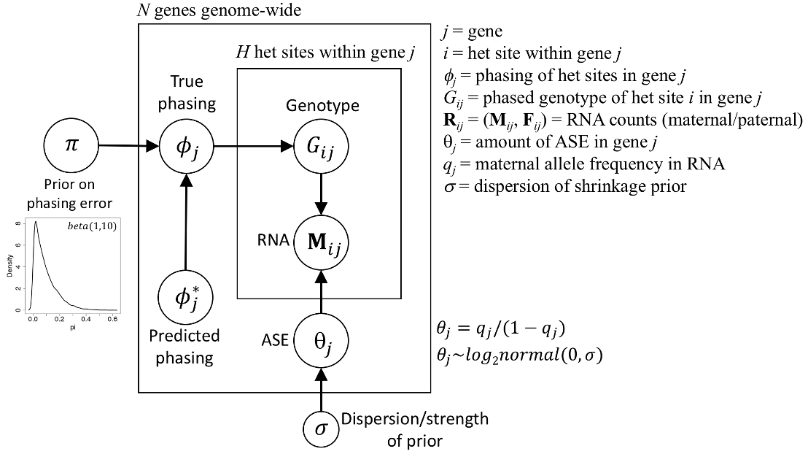

# BEASTIE
BEASTIE (Bayesian Estimation of Allele Specific Transcription Integrating across Exons) is a software suite for identifying allele-specific-expression (ASE) from regulatory variants from RNA-seq and WGS data.
BEASTIE uses a Bayesian hierarchical model to integrate prior information with read count data and genetic data. Using MCMC (Markov Chain Monte Carlo), BEASTIE efficiently performs posterior inference to estimate effect sizes of ASE. <br>
BEASTIE has been found to be substantially more accurate than other tests based on the binomial distribution.

## Description
To be added ...



## Download
BEASTIE can be downloaded from XXXX

## Installation
### Prerequisites for installing BEASTIE
The following are required to install and run BIRD directly on your system:
* BEASTIE has been tested on **Linux**. It may or may not work on other UNIX systems.
* [CmdStan](https://mc-stan.org/users/interfaces/cmdstan) must be installed.  This is the command-line interface to the STAN statistical programming language.
* [Python](https://www.python.org/downloads/release/python-360/) version 3.6 or higher is required.

### Installing and Compiling BEASTIE source code
First download BEASTIE, copy its files into your working directory.
```python
s = "example code"
```
Then, install [CmdStan](https://mc-stan.org/users/interfaces/cmdstan), and set the environment variable $STAN to the directory where CmdStan has been installed. XXXXXXXXXXXX
```python
s = "example code"
```
## Running BEASTIE
### Prerequisites
Before the BEASTIE model can be run, you must create a file containing the read counts for each allele of a gene.  The format of this required file is described below.
```
gene_ID | ALT1 | REF1 | ALT2 | REF2 | pred_prob
```
### Input Format
The model must be run in the $STAN directory.  The following command will run the model on a set of variants:
```
BEASTIE.py A B C D > out.txt
```
The parameters are:
* A
* B
* C
* D
## Running the model
### Output Format
The output consists of XXX columns: ???

## Example Inputs and Outputs
In the $BEASTIE directory is a file XXX(....HG00096/NA12878/simulated?)
