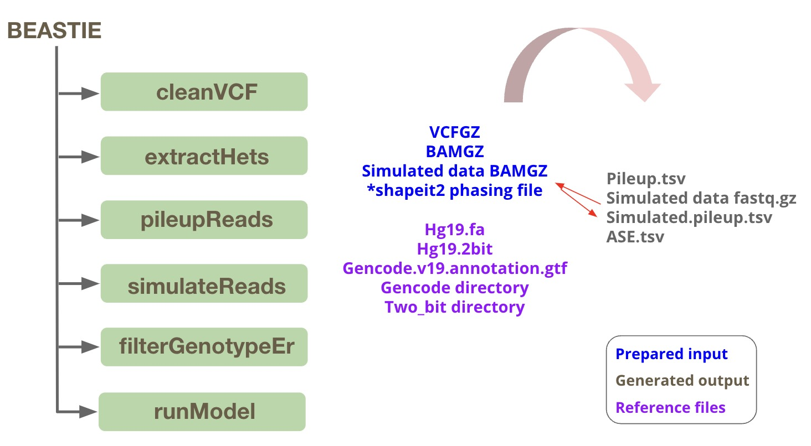

# BEASTIE: A bioinformatics pipeline for gene level ASE estimation
BEASTIE (Bayesian Estimation of Allele Specific Transcription Integrating across Exons) is a software suite for identifying allele-specific-expression (ASE) from regulatory variants from RNA-seq and WGS data.
BEASTIE uses a Bayesian hierarchical model (QuickBEAST) in https://github.com/x811zou/QuickBEAST to integrate prior information with read count data and genetic data. Using MCMC (Markov Chain Monte Carlo), BEASTIE efficiently performs posterior inference to estimate effect sizes of ASE. <br>

The BEASTIE workflow is currently set up for gene-level ASE estimation.

BEASTIE has been found to be substantially more accurate than other tests based on the binomial distribution.

BEASTIE is free for academic and non-profit use.

### Summary of workflow



This workflow is summarized step-by-step below 'example code usage' section.

### Easy test if you just want to run the QuickBEAST model instead of the full pipeline, please go here: 
```
https://github.com/x811zou/QuickBEAST
```

## Installation options
### Using Docker Image locally:
Docker does not allow the container any access to the host system by default. To allow the BEASTIE container to access necessary
files on the host system you need use the `-v` flag to "mount" a host directory at a particular mount point inside the container.

If all your data and outputs exist under the current directory, the following template should work for running BEASTIE. Just replace "<BEASTIE_IMAGE>" with the docker image and "<config_file>" with the path to your BEASTIE configuration file.

```bash
% docker run -v "`pwd`":"`pwd`" xuezou/beastie -c <config_file>
```

### Using Singularity in cluster:
We don't build a singularity image directly, but you can build one using the docker image. 

1. pull docker image from Dockerhub, and create beastie.tar file
```bash
% docker save --output beastie.tar xuezou/beastie
```

2. copy the beastie.tar file to your cluster using scp

3. Create a singularity image, `beastie.sif` that can potentially be run like
```bash
% singularity build -s beastie.sif docker-archive://beastie.tar
```

4. Run
```bash
% singularity run --bind <directory> beastie.sif -c <config_file>
```

### Customized installation:
#### Software prerequisites
Only if you want to use our recommended pipeline to align RNAseq reads and modify the pipeline:
* [bedtools2.25](https://bedtools.readthedocs.io/en/latest/content/installation.html)
* [picard](https://broadinstitute.github.io/picard/) - set location as $picard_path
* [samtools1.9](https://github.com/samtools/samtools)
* [htslib-1.12](http://www.htslib.org/download/)
* [STAR2.7](https://github.com/alexdobin/STAR)  - set location as $STAR


The following tools are required to install and run BEASTIE directly on your system:
* BEASTIE has been tested on **Linux**. It may or may not work on other UNIX systems.
* [Python 3.6](https://www.python.org/downloads/release/python-360/) version 3.6 or higher is required.
* [R 4.0](https://cran.r-project.org/bin/macosx/)

The following Python packages are required to install in your system:
* os, sys, configparser, subprocess, pandas, re, pickle, numpy

Most of these pakages can be installed from CRAN using the `install.packages` R function. However, "pasilla" is a Bioconductor package and must be installed using the
[Bioconductor Manager](https://cran.r-project.org/web/packages/BiocManager/index.html) package. Once BiocManager is installed run `BiocManager::install("pasilla")` to install it.
Git clone our BEASTIE scripts and example data in your working directory ($workdir)
```bash
% git clone --recurse-submodules https://github.com/x811zou/BEASTIE.git
```

Register [LD token](https://ldlink.nci.nih.gov/?tab=apiaccess)

install BEASTIE docker:
```bash
% cd $workdir/BEASTIE
% make install
```

or install BEASTIE into a python virtual environment:
```bash
% cd $workdir/BEASTIE
% virtualenv -p python3 venv # create a new virtual environment with at least python 3.8
% ./venv/bin/activate
% make install
```

----------------------------------------
Optional preparation step: process raw fastq data
----------------------------------------

a. trim raw RNAseq fastq reads using [Trimmomatic](http://www.usadellab.org/cms/?page=trimmomatic)
```bash
# install at $trimmomatic_path
wget http://www.usadellab.org/cms/uploads/supplementary/Trimmomatic/Trimmomatic-0.39.zip

% java -jar $trimmomatic_path/trimmomatic-0.33.jar PE -threads 16 -phred33 $fastq_R1 $fastq_R2 \
     $trimmed_fastq/${sample}_FWD_paired.fq.gz $trimmed_fastq/${sample}_FWD_unpaired.fq.gz \
     $trimmed_fastq/${sample}_REV_paired.fq.gz $trimmed_fastq/${sample}_REV_unpaired.fq.gz \
     ILLUMINACLIP:$trimmomatic_reference/trimmomatic_MHPS.fa:2:30:10:8:TRUE LEADING:3 TRAILING:3 SLIDINGWINDOW:4:15 MINLEN:36
```
The parameters are:
* $trimmed_fastq: saving trimmed fastq output path
* $sample: sample name or prefix for output


b. align reads with STAR<br>
We have done extensive comparison on RNAseq alignes reference allele mapping bias, and found that the best one with high efficiency and minimal bias is splice-aware aligner STAR with 2pass EndtoEnd alignment mode and WASP filtering : https://github.com/alexdobin/STAR. If you prefer to use aligned BAM files, you can directly use that as input.
```bash
% STAR --twopassMode Basic --runThreadN 24 --genomeDir $star_ind \
      --readFilesIn $fastqDir/${sample}_FWD_paired.fq.gz $fastqDir/${sample}_REV_paired.fq.gz \
      --alignEndsType EndToEnd \
      --waspOutputMode SAMtag \
      --varVCFfile $VCF \
      --outFilterMismatchNmax 10 \
      --outSAMtype BAM SortedByCoordinate \
      --outReadsUnmapped Fastx \
      --outSAMattributes NH HI NM MD AS nM jM jI XS vA vG vW \
      --readFilesCommand "gunzip -c" \
      --outFileNamePrefix $output_prefix

% java -jar $picardDir/picard.jar MarkDuplicates \
     I=$output_prefix/Aligned.sortedByCoord.out.bam \
     O=$output_prefix/Aligned.sortedByCoord.out.picard_markdup.bam
```
The parameters are:
* $fastqDir: input path for trimmed fastq
* $star_ind: index for STAR aligner
* $VCF: VCF file for sample. VCF file has 'chr' in the chromosome column.
* $sample: sample name or prefix for output
* $output_prefix: output path with output prefix for aligned BAM


----------------------------------------
Input Preparation & Testing data
----------------------------------------
* sample.vcf.gz
* sample.bam.gz
* shapeit2 phasing file
* reference directory (gencode reference, Allele frequency reference extracted from 1000 Genome Project across different ancestries)
* optional testing data
  <br>
Download testing data and/or reference files from shared google drive folder:
Example testing data: "NA12878_chr21"<br>
Zipped reference data: unzip and set the environment variable $refdir to the directory where reference folder has been unzipped.
```
https://drive.google.com/drive/folders/1z63jSyNWBKFJu4CZ4z54OFXHK8LsXu9O?usp=drive_link
```

----------------------------------------
Example code usage (details in the run_BEASTIE.sh file):
----------------------------------------
This running script has parameters definition and all options.
```
sh run_BEASTIE.sh
```
#### step0: Clean VCF file.
* Only keep bi-allelic het sites
```
docker run  -v `pwd`:`pwd` -v $working_dir:/mnt xuezou/beastie
    cleanVCF \
    --tmp-dir $tmp_vcf_dir \
    --vcfgz-file $input_vcfgz \
    --filtered-bi-vcfgz $output_bi_vcfgz \
    --filtered-bihets-vcfgz $output_bihets_vcfgz
```
NOTES:<br>
     1. when VCF hdoes not as PASS on quality score filtering result on VCF fields[7], use --skip-require-pass and --quality-score-min <10> to specify the cutoff<br>
     2. when VCF has PASS on quality score filtering result on VCF fields[7], in default --quality-score-min 0, --skip-require-pass is not needed

#### step1: Extract Heterozygous sites from gencode reference on VCF file.
* Extract heterozygous sites from gencode reference for samtools mpileup (We provide pre-split gencode v19 for all 22 chromosome in reference folder, users are free to use their version of gencode reference and use vcftools tools to split it).
* Parse pileup read counts by our faster version python script originally adopted from [ASEreadCounter](https://github.com/gimelbrantlab/ASEReadCounter_star).
* Thinning reads by read length. One read only count once.
* Annotate AF and LD for bi-allelic het SNPs pairs
```
docker run -v `pwd`:`pwd` -v $working_dir:/mnt xuezou/beastie \
    extractHets \
    --vcfgz-file $output_bihets_vcfgz \
    --out-hetSNP $output_hetSNP \
    --chr-start $chr_start \
    --chr-end $chr_end \
    --gencode-dir $ref_dir/reference/gencode_chr 
```

#### step2: Parsing gene coverage from aligned BAM file using SAMTOOLS PILEUP.
```
docker run -v `pwd`:`pwd` -v $working_dir:/mnt xuezou/beastie \
    pileupReads \
    --tmp-dir $tmp_mpileup_dir \
    --in-hetSNP $output_hetSNP \
    --in-BAMGZ $input_bamgz \
    --out-pileupGZ $output_pileup_gz \
    --chr-start $chr_start \
    --chr-end $chr_end \
    --ref $ref_dir/reference/hg19/hg19.fa
```
* pile up reads for each variant. The command used in this step: 
```bash
% samtools mpileup -d 0 -B -s -f $ref -l $het_sites_for_mpileup $bam > ${prefix}.pileup
```

#### step3: Simulate unbiased fastq reads on each allele for each gene.
```
docker run -v `pwd`:`pwd` -v $working_dir:/mnt xuezou/beastie \
    simulateReads \
    --tmp-dir $tmp_simulation_dir \
    --vcfgz-file $output_bi_vcfgz \
    --in-BAMGZ $input_bamgz \
    --out-fwd-fastq $output_fwd_fastqreads \
    --out-rev-fastq $output_rev_fastqreads \
    --chr-start $chr_start \
    --chr-end $chr_end \
    --ref-genome-2bit $ref_dir/reference/hg19/hg19.2bit \
    --ref-gff $ref_dir/reference/gencode.v19.annotation.level12.gtf \
    --ref-twobit $ref_dir/reference/two_bit_linux
```
#### Required action: align simulated fastq reads with the same alignment tool/parameters you used for your data. Then use step2 to do pileup for the aligned BAM for simulated reads. 

#### step4: Filter out het sites with genotyping errors.
```
docker run -v `pwd`:`pwd` -v $working_dir:/mnt xuezou/beastie \
    filterGenotypingError \
    --filtered-hetSNP-file $output_hetSNP_filtered \
    --genotype-error-file $output_genotypeEr \
    --vcfgz-file $output_bihets_vcfgz \
    --pileupGZ-file $output_pileup_gz \
    --input-hetSNP-file $output_hetSNP \
    --ancestry $ancestry \
    --read-length $read_length \
    --chr-start $chr_start \
    --chr-end $chr_end \
    --af-dir $ref_dir/reference/AF \
    --genotypeEr-cutoff $genotypeEr_cutoff \
    --out-dir $tmp_genotypeEr_dir \
    --warmup $WARMUP \
    --keeper $KEEPER 
```
#### step5: run BEASTIE
* Convert data in format for model input
* Predict phasing error using trained logistic regression
* Update model input with predicted phasing error
* Run BEASTIE model
* Generate gene list with user-defined p-value cutoff

(1): run BEASTIE with phasing from VCF file.
```
docker run -v `pwd`:`pwd` -v $working_dir:/mnt xuezou/beastie \
    runModel \
    --vcfgz-file $bihets_vcfgz \
    --vcf-sample-name $sample_name_in_vcf \
    --filtered-hetSNP-file $output_hetSNP_filtered \
    --ancestry $ancestry \
    --chr-start $chr_start \
    --chr-end $chr_end \
    --min-single-cov $min_single_count \
    --min-total-cov $min_total_count \
    --read-length $read_length \
    --output-dir $output_dir/beastie/phased_even${read_length}_VCF \
    --ldlink-cache-dir $base_dir \
    --save-intermediate \
    --alignBiasP-cutoff $binomialp_cutoff \
    --ase-cutoff $FDR_cutoff \
    --ld-token $LD_token \
    --simulation-pileup-file $input_simulation_pileup_gz
```
(2): run BEASTIE with phasing from provided shapeit2 files or other phasing software.
```
docker run  -v `pwd`:`pwd` -v $working_dir:/mnt xuezou/beastie \
    runModel \
    --vcfgz-file $bihets_vcfgz \
    --vcf-sample-name $sample_name_in_vcf \
    --filtered-hetSNP-file $out_hetSNP_filtered \
    --ancestry $ancestry \
    --chr-start $chr_start \
    --chr-end $chr_end \
    --min-single-cov $min_single_count \
    --min-total-cov $min_total_count \
    --read-length $read_length \
    --output-dir $out_dir/beastie/phased_even${read_length}_shapeit2 \
    --ldlink-cache-dir $base_dir \
    --save-intermediate \
    --alignBiasP-cutoff $binomialp_cutoff \
    --ase-cutoff $FDR_cutoff \
    --ld-token $LD_token \
    --simulation-pileup-file $input_simulation_pileup_gz \
    --shapeit2-phasing-file $input_shapeit2
```

### Citing:
Please cite this paper when using BEASTIE for your publications.
```
Zou, X., Gomez, Z. W., Reddy, T. E., Allen, A. S., Majoros, W. H. (2024). Bayesian Estimation of Allele-Specific
Expression in the Presence of Phasing Uncertainty. bioRxiv, doi: 10.1101/2024.08.09.607371.
```

### Acknowledgements:
The bioinformatics pipeline was developed by Scarlett (Xue Zou). We thank Bill for his guidance in this project, Zack and Tomas for their help in maintaining this software. For further information, inquiries, or contributions, please feel free to contact [Xue Zou](mailto:xz195@duke.edu).
